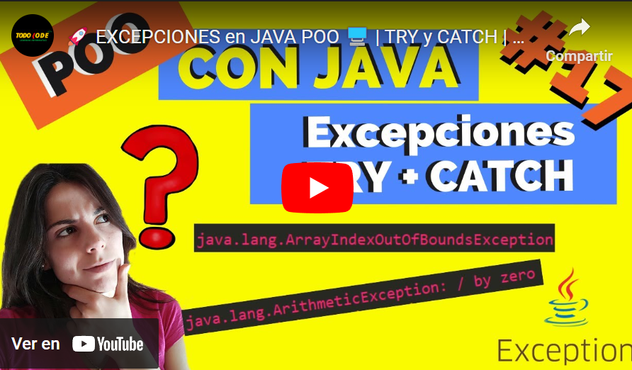
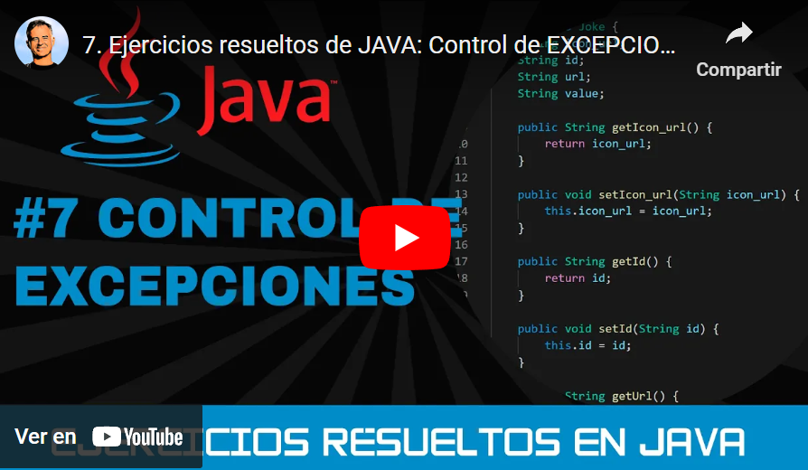

## Temas a tratar

En esta clase se abordarán las siguientes temáticas:

- **Manejo de Excepciones en Java**
    - ¿Qué son las excepciones?
    - Tipos de excepciones: Propias de Java (Checked y Unchecked) y personalizadas
    - Diferencia entre errores y excepciones
    - Try, Catch y Finally
    - Throw y Throws

---

## ¿Qué son las excepciones?

Las **excepciones** en programación son eventos o condiciones inusuales que pueden ocurrir durante la ejecución de un programa y que pueden interrumpir su flujo normal. Estas situaciones anómalas pueden incluir errores de tiempo de ejecución, como intentar dividir por cero, acceder a un elemento fuera de los límites de un arreglo, abrir un archivo que no existe o una conexión de red que falla. Las excepciones son mecanismos utilizados para manejar estos errores y problemas de manera controlada en lugar de permitir que el programa se bloquee o se cierre inesperadamente.

Cuando una excepción ocurre, el programa puede lanzar una "excepción" que contiene información sobre el error, como su tipo y detalles específicos. Luego, el programa puede manejar esta excepción de diversas maneras, como imprimir un mensaje de error, tomar acciones correctivas o incluso permitir que continúe la ejecución.

El uso de excepciones en programación es fundamental para escribir código robusto y controlar errores de manera elegante, lo que ayuda a mantener la integridad de un programa incluso cuando se enfrenta a situaciones inesperadas.

---

## Tipos de excepciones

En **Java**, las excepciones se dividen en dos categorías principales: Excepciones personalizadas o definidas por el usuario y excepciones propias de Java o Built-In exceptions.


Al mismo tiempo, las excepciones propias de Java se subdividen en otros dos tipoos principales: excepciones verificadas (**checked exceptions**) y excepciones no verificadas (**unchecked exceptions**). Veamos cada una de ellas en detalle.

---

## Excepciones propias de Java

### Excepciones verificadas (Checked Exceptions)

Estas excepciones son las que debes manejar explícitamente en tu código, ya que el compilador de Java verifica si se han manejado o se han declarado correctamente. Las excepciones verificadas son subclases de la clase `java.lang.Exception` (excepto las que son subclases de `RuntimeException`). Algunos ejemplos de excepciones verificadas son:

- **IOException:** Esta excepción se utiliza para manejar errores relacionados con la entrada y salida de datos, como lectura o escritura de archivos.
    
- **SQLException:** Se utiliza para manejar excepciones relacionadas con bases de datos y consultas SQL.
    
- **ClassNotFoundException:** Se lanza cuando la clase requerida no puede ser encontrada en tiempo de ejecución.
    
- **InterruptedException:** Se utiliza para manejar excepciones relacionadas con la concurrencia y la administración de hilos.


### Excepciones no verificadas (Unchecked Exceptions):

Estas excepciones no requieren un manejo explícito y no se verifican en tiempo de compilación. Suelen ser subclases de la clase `java.lang.RuntimeException`. Las excepciones no verificadas generalmente indican errores en el código que el programador debe corregir. Algunos ejemplos de excepciones no verificadas son:

- **ArithmeticException:** Se lanza cuando ocurre una excepción aritmética, como una división por cero.
    
- **NullPointerException:** Se lanza cuando se intenta acceder a un objeto que es nulo.
    
- **ArrayIndexOutOfBoundsException:** Se lanza cuando se intenta acceder a un índice fuera de los límites de un arreglo.
    
- **IllegalArgumentException:** Se utiliza para indicar que un argumento pasado a un método no es válido.


---

## Excepciones personalizadas

Una excepción personalizada en Java es una excepción que tú mismo creas para manejar situaciones excepcionales específicas que no pueden manejarse adecuadamente con las excepciones estándar proporcionadas por el propio lenguaje. Esto te permite definir tus propias clases de excepción con un comportamiento y un mensaje de error personalizado.

Para crear una excepción personalizada en Java, sigue estos pasos:

- Define una clase que extienda de Exception (o cualquier subclase de Exception adecuada) o implemente la interfaz Throwable.

```java
public class MiExcepcionPersonalizada extends Exception {
    public MiExcepcionPersonalizada() {
        super();
    }

    public MiExcepcionPersonalizada(String mensaje) {
        super(mensaje);
    }
}
```

- En la clase, puedes agregar constructores personalizados según tus necesidades. En el ejemplo anterior, se han agregado dos constructores: uno sin argumentos y otro que toma un mensaje de error personalizado.
    
- Dentro de tu excepción personalizada, puedes incluir métodos adicionales si es necesario. Estos métodos pueden proporcionar información adicional o realizar ciertas acciones relacionadas con la excepción.
    
- Para lanzar tu excepción personalizada, simplemente deberás utilizar la palabra clave **throw** seguida de una instancia de tu excepción (puedes hacerlo en cualquier parte de tu código). Por ejemplo:

```java
public void miMetodo() throws MiExcepcionPersonalizada {
    // Código del método
    if (/* alguna condición que requiere lanzar la excepción */) {
        throw new MiExcepcionPersonalizada("Ocurrió un error personalizado");
    }
}
```

- En el código anterior, se lanza la excepción personalizada MiExcepcionPersonalizada si se cumple una cierta condición en el método miMetodo.
    
- Al usar tu excepción personalizada, puedes capturarla y manejarla en bloques try-catch de la misma manera que lo harías con excepciones estándar de Java.
    

Crear excepciones personalizadas es útil cuando deseas proporcionar información específica sobre el tipo de error que ha ocurrido en tu aplicación. Esto facilita la depuración y el mantenimiento del código, ya que los mensajes de error son más descriptivos y permiten identificar mejor el problema.


### Veamos esto aplicado en un escenario real

Un escenario común para el uso de excepciones personalizadas es en la validación de datos de entrada en una aplicación. Imagina que estás desarrollando un sistema de gestión de una biblioteca, y necesitas validar los datos ingresados al momento de agregar un nuevo libro a la biblioteca. Podrías crear una excepción personalizada llamada DatosInvalidosException para manejar situaciones en las que los datos proporcionados son incorrectos o incompletos.

```java
public class DatosInvalidosException extends Exception {
    public DatosInvalidosException(String mensaje) {
        super(mensaje);
    }
}

public class Biblioteca {
    public void agregarLibro(String titulo, String autor, int anioPublicacion) throws DatosInvalidosException {
        if (titulo == null || titulo.isEmpty() || autor == null || autor.isEmpty() || anioPublicacion < 0) {
            throw new DatosInvalidosException("Los datos del libro son inválidos.");
        }

        // Lógica para agregar el libro a la biblioteca
        // ...
    }
}
```

En este ejemplo:

- Hemos creado una excepción personalizada llamada DatosInvalidosException.
    
- El método agregarLibro en la clase Biblioteca recibe tres parámetros: el título del libro, el autor y el año de publicación.
    
- Antes de agregar el libro a la biblioteca, se realiza una validación de datos. Si alguno de los datos es nulo, vacío o si el año de publicación es negativo, se lanza la excepción personalizada DatosInvalidosException con un mensaje descriptivo.
    
- El código que llama a agregarLibro puede capturar esta excepción y tomar medidas adecuadas, como mostrar un mensaje de error al usuario o registrar la excepción en un archivo de registro.
    
- El uso de una excepción personalizada en este escenario permite comunicar de manera clara y específica que los datos ingresados son inválidos, lo que ayuda a mejorar la robustez y la mantenibilidad de la aplicación.
    

---

## Errores vs Excepciones

Los **"errores"** en Java son problemas graves que indican fallas en el entorno de ejecución o en la infraestructura del sistema, como por ejemplo quedarse sin memoria o problemas en la JVM (Java Virtual Machine). Estos errores son **irreparables** y no es posible (generalmente) manejarlos en el código de la aplicación, ya que generalmente no se pueden resolver o no se puede prever que sucedan.

Por otro lado, las **"excepciones"** son situaciones excepcionales y previsibles que pueden ocurrir en la ejecución de un programa. Estas situaciones pueden ser causadas por acciones del usuario, operaciones fallidas o condiciones inusuales. A diferencia de los errores, las excepciones son recuperables y se espera que se manejen en el código para tomar acciones correctivas y permitir que el programa continúe su ejecución de manera controlada.

Veamos un poco sus similitudes y diferencias de forma resumida y detallada

| Aspecto          | Excepciones                                                                                                               | Errores                                                                                          |
| ---------------- | ------------------------------------------------------------------------------------------------------------------------- | ------------------------------------------------------------------------------------------------ |
| Propósito        | Manejar situaciones excepcionales y previsibles en el flujo de ejecución.                                                 | Indicar problemas graves en el entorno de ejecución o la infraestructura del sistema.            |
| Gravedad         | Problemas controlables y recuperables.                                                                                    | Problemas graves e irreparables.                                                                 |
| Causa            | Causadas por acciones del usuario, operaciones fallidas o condiciones inusuales.                                          | Generalmente relacionados con el entorno de ejecución, como falta de memoria o fallos en la JVM. |
| Manejo           | Deben manejarse en el código de la aplicación para tomar acciones correctivas y permitir la continuación de la ejecución. | No se deben manejar ni recuperar en el código de la aplicación, ya que son irreparables.         |
| Ejemplos comunes | NullPointerException, IOException, NumberFormatException.                                                                 | OutOfMemoryError, StackOverflowError, NoClassDefFoundError.                                      |

---

## Try, Catch y Finally

En lenguajes de programación como Java, C#, Python y muchos otros, las excepciones se gestionan mediante bloques de código try-catch.

El código que podría generar una excepción se coloca dentro del bloque "try", y si ocurre una excepción, se captura y se maneja en el bloque "catch". Esto permite al programador definir cómo reaccionar ante un error de manera específica en lugar de simplemente dejar que el programa se bloquee.

**¡Veamos de qué se trata!**

### Try

El **bloque try** se utiliza para encerrar un conjunto de instrucciones que podrían lanzar una excepción. Dentro de este bloque, se coloca el código que se sospecha puede generar una excepción. Si ocurre una excepción dentro del bloque try, el flujo de ejecución del programa se interrumpe y se pasa al bloque catch correspondiente.

```java
try {
    // Código que puede generar una excepción
    int resultado = 10 / 0; // Esto generará una excepción de división por cero (ArithmeticException)
} 
```


### Catch

El **bloque catch** se utiliza para capturar y manejar una excepción que se ha lanzado en el bloque try. Debe ir después del bloque try y puede manejar uno o más tipos de excepciones específicas. Si ocurre una excepción dentro del bloque try, Java busca el bloque catch adecuado para manejar esa excepción.

```java
catch (ArithmeticException e) { // Código para manejar la excepción de división por cero System.out.println("¡Ha ocurrido un error de división por cero!"); }
```

Puede haber más de un bloque catch en un bloque try en Java. Esto permite manejar diferentes tipos de excepciones de manera específica. Cada bloque catch se encargará de manejar un tipo de excepción diferente.

```java
try {
    // Código que puede generar una excepción
    int resultado = 10 / 0; // Esto generará una excepción de división por cero (ArithmeticException)
} catch (ArithmeticException e) {
    // Manejar la excepción de división por cero
    System.out.println("¡Ha ocurrido un error de división por cero!");
} catch (NullPointerException e) {
    // Manejar una excepción de puntero nulo (NullPointerException) si ocurriera
    System.out.println("¡Se ha intentado acceder a un objeto nulo!");
}
```


### Finally

Además del try y el catch, existe otro bloque complementario llamado "finally". puede estar presente después de uno o más bloques catch. El bloque finally es opcional y se utiliza para contener código que debe ejecutarse sin importar si se produce una excepción o no. Su función principal es garantizar que ciertas acciones se realicen, como liberar recursos, cerrar conexiones o limpiar memoria, independientemente de si se ha lanzado una excepción o no.

```java
try {
    // Código que puede generar una excepción
} catch (Exception e) {
    // Manejar la excepción
} finally {
    // Este bloque se ejecutará siempre, independientemente de si se lanzó una excepción o no
    System.out.println("Este bloque se ejecutará siempre.");
}
```

El bloque finally es especialmente útil para tareas de limpieza o liberación de recursos, ya que garantiza que estas tareas se realicen correctamente, incluso en situaciones de excepción.

**¡Veamos un ejemplo!**

```java
try {
    // Código que puede generar una excepción
} catch (Exception e) {
    // Manejar la excepción
} finally {
    // Este bloque se ejecutará siempre, independientemente de si se lanzó una excepción o no
    System.out.println("Este bloque se ejecutará siempre.");
}
```

---

## Throw y Throws

Si entramos en detalles sobre las excepciones nos encontraremos con dos palabras claves de Java en lo que a esto respecta: throw y throws.

**"throw"** es una palabra clave en Java que, en términos generales, se traduce al español como "lanzar" o "arrojar". Su función principal es permitir que los programadores generen y lancen excepciones de manera explícita en puntos específicos de su código. Esto es útil cuando se encuentra una situación excepcional que debe ser comunicada al programa.

Por ejemplo, si se detecta que es posible que haya una situación inusual en una operación aritmética, se puede lanzar una excepción ArithmeticException de la siguiente manera:

```java
throw new ArithmeticException("División por cero");
```

**"throws"** se traduce al español como "lanza" o "declara" en un contexto de declaración de excepciones. En Java, esta palabra clave se utiliza al final del nombre de un método para indicar que el mismo tiene la capacidad de lanzar excepciones de un tipo específico.

Throws no maneja las excepciones internamente, sino que informa acerca de las excepciones que deben ser manejadas si se ejecuta o utiliza este método. Básicamente utiliza la expresión "Este método ARROJA/PUEDE ARROJAR este tipo determinado de excepción"

Por ejemplo, supongamos que se tiene un método de lectura de archivos que puede generar excepciones de tipo IOException.

Al usar "throws" en el nombre del método, se informa que tipos de excepciones se deben manejar o tener en cuenta al llamar a ese método:

```java
public void leerArchivo(String nombreArchivo) throws IOException {
    // Código de lectura de archivo
}
```

---

## Extra

¿Te quedaron dudas respecto a las excepciones? Te dejamos una seris de videos complementario con explicaciones teóricas y ejemplos prácticos.

[](https://youtu.be/VHy6xFXJ1Rw)

[](https://youtu.be/vhkhmCmNG_4)

[](https://youtu.be/iGcX-uZxMZY)
