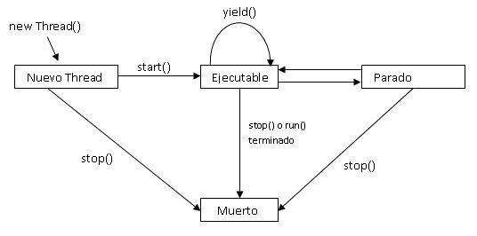
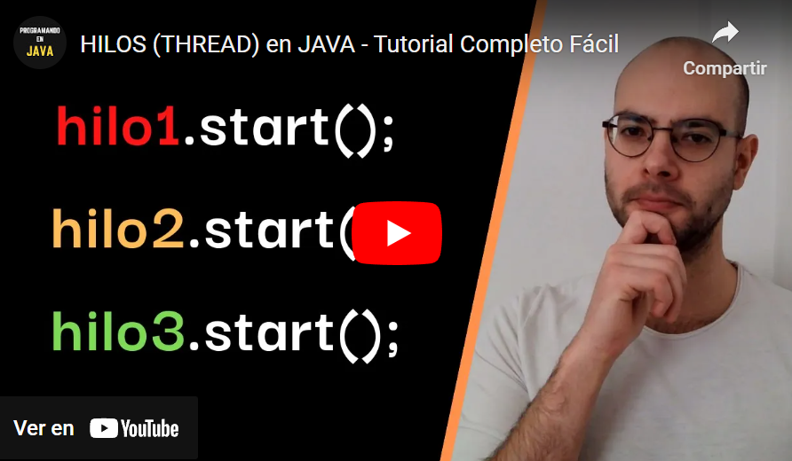
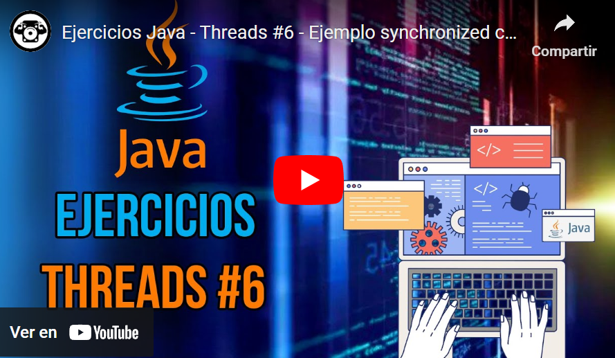

## Temas a tratar

En esta clase se abordarán las siguientes temáticas:

- **Hilos y Concurrencia en Java**
    - ¿Qué son los hilos? ¿Qué es la concurrencia?
    - Ciclo de vida de los hilos
    - Formas de crear hilos en Java
        - Mediante la clase _Thread_
        - Mediante _Runnable_
    - Métodos Sincronizados en Java (_Synchronized_)


---

## ¿Qué es la concurrencia?

La concurrencia se refiere a la capacidad de un sistema o programa para realizar múltiples tareas al mismo tiempo, de manera aparentemente simultánea. En un contexto de programación, la concurrencia implica que múltiples hilos de ejecución o procesos están en funcionamiento al mismo tiempo y realizando sus tareas de manera independiente o concurrente.

La concurrencia es esencial en la programación y la informática por varias razones:

- Mejora el **rendimiento**: Permite aprovechar la capacidad de procesamiento de sistemas multi núcleo y paralelos para realizar tareas de manera más eficiente. Esto puede acelerar la ejecución de programas, especialmente en aplicaciones que realizan tareas intensivas en cómputo.
    
- Mejora la **capacidad de respuesta**: En aplicaciones interactivas, como aplicaciones web o de usuario, la concurrencia puede garantizar que la interfaz de usuario no se bloquee mientras se realizan tareas en segundo plano. Los usuarios pueden interactuar con la aplicación sin experimentar retrasos notables.
    
- Mejora la **escalabilidad**: En aplicaciones de servidor, como aplicaciones web o servicios en la nube, la concurrencia permite atender a múltiples solicitudes de manera concurrente, lo que facilita la escalabilidad horizontal para admitir más usuarios o cargas de trabajo.    

La concurrencia se puede lograr mediante el uso de hilos, procesos, o incluso máquinas virtuales separadas, dependiendo de los requisitos específicos de la aplicación. En lenguajes de programación como Java, se utilizan hilos para implementar la concurrencia. Cada hilo representa una secuencia de ejecución independiente que puede realizar tareas concurrentemente con otros hilos.

---

## ¿Qué son los hilos (o Threads)?

Un **hilo** en Java, también conocido como "_thread_", es una unidad básica de ejecución que permite que un programa realice múltiples tareas de manera concurrente. En otras palabras, un hilo es una secuencia independiente de instrucciones que puede ejecutarse simultáneamente con otros hilos en el mismo programa.

Básicamente los hilos permiten la ejecución de varias partes de un programa al mismo tiempo en forma de subprocesos sin que uno interfiera con otro.


Si trabajamos con hilos tenemos que tener en cuenta los siguientes conceptos importantes:

- **Unidad de Ejecución:** Cada hilo representa una unidad de ejecución independiente dentro de un programa Java. Puede tener su propia secuencia de instrucciones y flujo de control.
    
- **Proceso Principal:** Cuando ejecutas un programa Java, en realidad estás iniciando un proceso principal que se ejecuta en un hilo. Este hilo principal es el que comienza la ejecución del programa y es donde se inicia generalmente la función `main()`.
    
- **Creación de Hilos:** En Java, puedes crear hilos de dos maneras principales:
    
    - **Heredando la clase Thread:** Puedes crear una clase que herede de _Thread_ y sobrescribir el método run(). Luego, puedes crear una instancia de esta clase y utilizar el método `start()` para iniciar el hilo.
        
    - **Implementando la interfaz Runnable:** Puedes implementar la interfaz _Runnable_ y proporcionar una implementación del método run(). Luego, puedes crear una instancia de esta implementación y ejecutarla en un hilo utilizando un objeto _Thread_.
        
    - ¡Esto lo veremos en detalle más adelante! ¡No te preocupes!
        
- **Sincronización y Comunicación:** Cuando varios hilos comparten recursos o datos, es necesario sincronizarlos para evitar problemas de concurrencia, como condiciones de carrera y bloqueos.
    
- **Ciclo de Vida de un Hilo:** Los hilos en Java tienen un ciclo de vida que incluye estados como "nuevo", "ejecutable" y "terminado".
    
- **Múltiples Núcleos:** En sistemas con múltiples núcleos de CPU, los hilos pueden ejecutarse de manera simultánea en núcleos diferentes, lo que puede mejorar significativamente el rendimiento en aplicaciones paralelizables.

---

## Ciclo de vida de un hilo en Java

La programación multihilo en Java implica la gestión de múltiples hilos de ejecución, cada uno con su propio ciclo de vida. Comprender el ciclo de vida de los hilos es esencial para controlar su comportamiento y garantizar una ejecución eficiente y segura en aplicaciones concurrentes.

- **Nuevo (New):** En esta etapa, un hilo se crea pero aún no se ha iniciado. Se instancia un objeto Thread, pero el hilo no ha comenzado a ejecutarse. En este estado, el hilo se encuentra inactivo.
    
- **Ejecutable (Runnable):** el hilo entra en el estado "Ejecutable". Esto significa que el hilo está listo para ejecutarse, pero no se garantiza que se esté ejecutando en un momento dado. El planificador de hilos de Java seleccionará cuándo se ejecutará, dependiendo de su prioridad y la disponibilidad de tiempo de CPU.
    
- **En Ejecución (Running):** Cuando el planificador de hilos asigna tiempo de CPU al hilo, entra en el estado "En Ejecución". En este estado, el hilo está ejecutando su código en un núcleo de CPU. Puede permanecer en este estado hasta que se complete su tarea o se suspenda deliberadamente.
    
- **Bloqueado (Blocked):** Un hilo puede ingresar al estado "Bloqueado" debido a varias razones, como esperar la liberación de un recurso o esperar una notificación. Mientras está bloqueado, el hilo no está ejecutando su código y no compite por el tiempo de CPU.
    
- **Esperando (Waiting) y en Espera con Tiempo Límite (Timed Waiting):** En estos estados, un hilo está a la espera de alguna condición específica.
    
- **Finalizado o Muerto (Terminated):** Un hilo alcanza el estado "Finalizado" cuando completa su ejecución o se detiene. En este punto, el hilo no se puede volver a ejecutar, y su ciclo de vida llega a su fin.



---

## Formas de crear hilos
    
Los hilos te permiten ejecutar tareas en paralelo, lo que puede ser útil para mejorar el rendimiento de tu programa en situaciones donde se pueden realizar múltiples tareas al mismo tiempo. Existen dos principales formas de crear y ejecutar hilos con Java. Veamos cada una de ellas.

### Mediante la clase Thread

La clase Thread tiene una serie de métodos para la creación y utilización de hilos y cada una de las etapas del ciclo de vida con la que cuentan. Veamos en detalle cada uno de ellos:

- **start():** Este método inicia la ejecución del hilo. Cuando se llama a start(), Java se encarga de programar la ejecución del hilo y llama al método run() que has definido en tu subclase de Thread. No debes llamar directamente a run(), ya que eso ejecutaría el código en el hilo actual, en lugar de iniciar un nuevo hilo.
	
- **run():** Debes sobrescribir este método en tu subclase de Thread para definir la tarea que el hilo realizará. El código que coloques en run() se ejecutará en paralelo cuando llames a start() en una instancia de tu hilo.
	
- **sleep(long millis):** Este método provoca que el hilo actual duerma durante la cantidad de tiempo especificada en milisegundos. Esto puede ser útil para introducir retrasos en la ejecución del hilo. Por ejemplo, Thread.sleep(1000) hará que el hilo duerma durante un segundo.
	
- **join():** El método join() permite que un hilo espere hasta que otro hilo haya terminado su ejecución. Puedes usar join() para sincronizar hilos y asegurarte de que ciertos hilos se completen antes de continuar con otros.
	
- **isAlive():** Este método verifica si el hilo aún está en ejecución. Devuelve true si el hilo está en ejecución y false si el hilo ha terminado su ejecución.
	
- **getId():** Devuelve el identificador único del hilo.
	
- **setName(String name):** Permite establecer un nombre personalizado para el hilo. Esto puede ser útil para identificar los hilos de manera más significativa en el registro.
	
- **getName():** Devuelve el nombre del hilo.
	
- **setPriority(int priority):** Establece la prioridad del hilo. La prioridad se utiliza para determinar cuánto tiempo de CPU se asigna al hilo en relación con otros hilos. Los valores válidos van desde Thread.MIN_PRIORITY (1) a Thread.MAX_PRIORITY (10).
	
- **getPriority():** Devuelve la prioridad del hilo.
	

Estos son algunos de los métodos más comunes en la clase Thread. Ten en cuenta que Java proporciona otras clases y mecanismos para el manejo de concurrencia, como ExecutorService y ThreadPoolExecutor, que son opciones más avanzadas y flexibles que el uso directo de Thread, sin embargo, no son generalmente necesarios en un día a día normal laboral.


#### Vamos a ver un ejemplo de código paso a paso de cómo llevar a cabo el manejo de hilos mediante la clase Thread

- En primer lugar vamos a crear una clase llamada **MiHilo** que extienda de la clase Thread y que tenga un atributo nombre para poder identificar a nuestro hilo como tal.

```java
class MiHilo extends Thread {
 private String nombre;

 public MiHilo(String nombre) {
     this.nombre = nombre;
 }
}
```

Al extender de la clase Thread debemos sobrescribir el método run de nuestra clase hija MiHilo para implementar qué acción va a ejecutar el hilo cuando esté corriendo.

```java
// Sobrescribir el método run() para definir la tarea del hilo
 @Override
 public void run() {
     for (int i = 1; i <= 5; i++) {
         System.out.println(nombre + ": Contador " + i);

         try {
             // Introducir una pequeña pausa para simular un trabajo
             Thread.sleep(1000);
         } catch (InterruptedException e) {
             System.out.println(e);
         }
     }
 }
```

Al mismo tiempo, vamos a generar una pausa en el hilo, mediante el método sleep (para fines prácticos) para simular como si estuviera ejecutando una determinada acción por cierto tiempo (en este caso 1000 mili segundos).
    
Una vez listo nuestra clase MiHilo con su método run implementado vamos a proceder al Main y vamos a crear dos hilos de tipo MiHilo utilizando el constructor por parámetros y vamos a colocar un nombre a cada hilo, así sabemos cual se está ejecutando y en qué momento:

```java
public class EjemploHilos {
   public static void main(String[] args) {
     // creamos dos hilos con el constructor por parémtros
     MiHilo hilo1 = new MiHilo("Hilo 1");
     MiHilo hilo2 = new MiHilo("Hilo 2");

     // Paso 2: Llama al método start() para iniciar ambos hilos
     hilo1.start();
     hilo2.start();
   }
 }
```

En este ejemplo, hemos creado dos hilos llamados "Hilo 1" y "Hilo 2" que extienden la clase Thread. Cada hilo tiene su propio método run(), donde definimos la tarea que realizarán. En este caso, simplemente imprimen un mensaje junto con un contador del 1 al 5 con una pausa de un segundo entre cada iteración.

Después de crear los hilos, llamamos al método start() en cada uno para iniciar su ejecución en paralelo. Java se encarga de administrar la ejecución de los hilos de manera concurrente.

Ten en cuenta que los resultados de la ejecución pueden variar, ya que la ejecución de hilos es concurrente y puede depender del sistema y el planificador de hilos de Java.

Este es un ejemplo básico para comprender cómo crear y ejecutar hilos en Java utilizando la clase Thread. Puedes personalizar la lógica de tus hilos para realizar tareas más complejas según tus necesidades.


### Mediante la interface Runnable

En Java, además de crear hilos extendiendo la clase Thread, también puedes crear hilos implementando la interfaz Runnable. La interfaz Runnable proporciona una forma más flexible de trabajar con hilos y es preferible en muchos casos, ya que permite que una clase se centre en la tarea que realizará el hilo sin tener que heredar de la clase Thread. **¡Veamos cómo hacerlo!**

- Definimos una clase que implemente la interfaz Runnable. Esta clase debe proporcionar una implementación del método run(), que define la tarea que se realizará en el hilo.

```java
public class MiClaseRunnable implements Runnable {
  @Override
  public void run() {
      // Definir la tarea que realizará el hilo aquí
      for (int i = 1; i <= 5; i++) {
          System.out.println("Contador " + i);

          try {
              Thread.sleep(1000); // Introducir una pausa para simular un trabajo
          } catch (InterruptedException e) {
              System.out.println(e);
          }
      }
  }
}
```

- Creamos en el main una instancia de la clase que implementa Runnable.

```java
Runnable miRunnable = new MiClaseRunnable();
```

- Pasamos la instancia de Runnable a un objeto de la clase Thread. Luego, llamamose al método start() en ese objeto de hilo para iniciar la ejecución del hilo.

```java
Thread miHilo = new Thread(miRunnable);
miHilo.start();
```

Ahora, el hilo se ejecutará utilizando la tarea definida en el método run() de la clase MiClaseRunnable.

Este enfoque es útil cuando deseas reutilizar la misma implementación Runnable en varios hilos. También permite una mejor separación de preocupaciones, ya que puedes centrarte en la tarea específica que realizará el hilo en la clase que implementa Runnable, y luego utilizar esa clase en varios hilos diferentes si es necesario.

Nuestro main (si quisiéramos implementar varios hilos) podría quedar de la siguiente manera:

```java
public class EjemploHilosConRunnable {
    public static void main(String[] args) {
        // Paso 2: Crear una instancia de la clase que implementa Runnable
        Runnable miRunnable = new MiClaseRunnable();

        // Paso 3: Crear un objeto de la clase Thread y pasar el Runnable
        Thread miHilo = new Thread(miRunnable);

        // Llamar al método start() para iniciar la ejecución del hilo
        miHilo.start();

        // Puedes crear y ejecutar más hilos utilizando la misma instancia de Runnable
        Thread otroHilo = new Thread(miRunnable);
        otroHilo.start();
    }
}
```


---
# Ejercicio práctico

Si has quedado con ganas de practicar un poco más y ver un poco más de código, te dejamos a continuación una propuesta de ejercicio práctico en video para que puedas poner en práctica algunos de los conocimientos adquiridos hasta el momento.

[](https://youtu.be/tpnasHx9WLg)

---

## Métodos sincronizados en Java (Synchronized)

En Java, la palabra clave _synchronized_ se usa para crear bloques de código o métodos sincronizados, lo que significa que solo un hilo a la vez puede ejecutar ese bloque de código o método. Esto se utiliza para garantizar que las secciones críticas de tu código sean ejecutadas de manera segura en entornos de concurrencia, evitando problemas como condiciones de carrera y garantizando que los datos compartidos se manejen de manera coherente.

Cuando aplicas _synchronized_ a un bloque de código o un método, estás creando un mecanismo de bloqueo para proteger ese código. Solo un hilo puede adquirir el bloqueo y ejecutar el código sincronizado a la vez. Otros hilos que intenten acceder a ese código sincronizado deben esperar hasta que el bloqueo esté disponible.

**¡Veamos un ejemplo!**

```java
public class EjemploSynchronized {
    private int contador = 0;

    public synchronized void incrementar() {
        contador++;
    }

    public synchronized int obtenerContador() {
        return contador;
    }

    public static void main(String[] args) {
        EjemploSynchronized ejemplo = new EjemploSynchronized();

        Thread hilo1 = new Thread(new Runnable() {
            @Override
            public void run() {
                for (int i = 0; i < 1000; i++) {
                    ejemplo.incrementar();
                }
            }
        });

        Thread hilo2 = new Thread(new Runnable() {
            @Override
            public void run() {
                for (int i = 0; i < 1000; i++) {
                    ejemplo.incrementar();
                }
            }
        });

        hilo1.start();
        hilo2.start();

        try {
            hilo1.join();
            hilo2.join();
        } catch (InterruptedException e) {
            e.printStackTrace();
        }

        System.out.println("Valor del contador: " + ejemplo.obtenerContador());
    }
}
```

- En este ejemplo se define una clase llamada EjemploSynchronized que contiene un contador (variable contador) y dos métodos marcados como synchronized: incrementar y obtenerContador.
    
- El método incrementar aumenta el valor del contador en 1. Como está marcado como synchronized, solo un hilo puede ejecutarlo a la vez, evitando condiciones de carrera y asegurando que el incremento sea seguro en un entorno de concurrencia.
    
- El método obtenerContador devuelve el valor actual del contador. También está marcado como synchronized, lo que garantiza que solo un hilo a la vez pueda acceder y leer el valor del contador.
    
- En el método main, se crea una instancia de EjemploSynchronized llamada ejemplo.
    
- Se crean dos hilos (hilo1 y hilo2) que ejecutan tareas para incrementar el contador en 1000. Cada hilo ejecuta un bucle que llama al método incrementar 1000 veces.
    
- Los hilos se inician con hilo1.start() y hilo2.start(), lo que hace que comiencen a ejecutar sus tareas en paralelo.
    
- El programa principal espera a que ambos hilos terminen sus tareas utilizando hilo1.join() y hilo2.join().
    
- Luego, se imprime el valor actual del contador mediante una llamada al método obtenerContador. Dado que los métodos incrementar y obtenerContador están sincronizados, el valor impreso será 2000, ya que cada hilo aumentó el contador en 1000.
    

En resumen, el código ilustra cómo usar synchronized para proteger datos compartidos entre múltiples hilos y garantizar que las operaciones de incremento y lectura sean seguras en un entorno **concurrente**.


### Ejemplo en vídeo

Como sabemos que los métodos de sincronización pueden ser un tema difícil cuando trabajamos con hilos, te dejamos a continuación un video con un ejercicio práctico explicado paso a paso.

[](https://youtu.be/yIuybxEzbt8)

