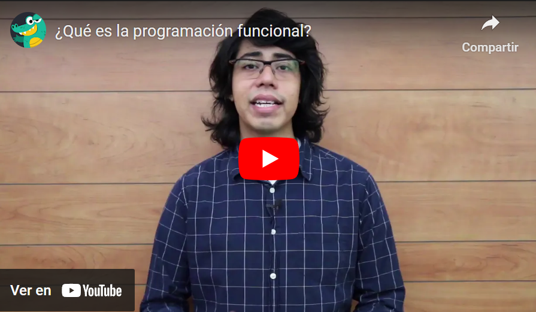
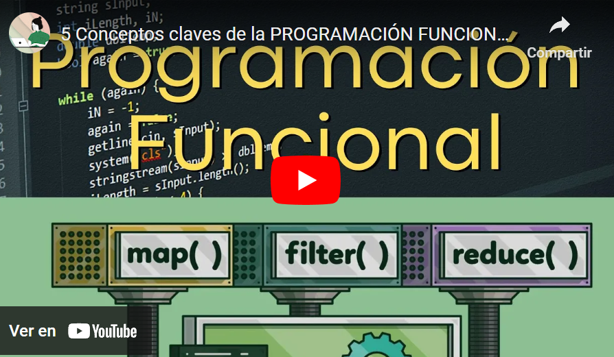

## Temas a tratar

En esta clase se abordarán las siguientes temáticas:

- **Programación Funcional en Java**
    - ¿Qué es la programación Funcional?
    - Expresiones o funciones Lambda
    - Referencias a métodos

---

## ¿Qué es la Programación Funcional?

La programación funcional es un paradigma de programación que se centra en el uso de funciones matemáticas y evita cambiar el estado y los datos mutables. En lugar de modificar datos, la programación funcional se basa en la evaluación de funciones y la creación de transformaciones de datos.

Algunos de los conceptos clave de la programación funcional son:

- **Funciones de primera clase:** Esto significa que puedes pasar funciones como argumentos a otras funciones, devolver funciones como resultados y asignar funciones a variables.
    
- **Inmutabilidad:** Los datos en la programación funcional son inmutables, lo que significa que no se pueden cambiar una vez creados. En lugar de modificar un dato existente, se crean nuevas versiones de los datos con las transformaciones necesarias.
    
- **Transparencia referencial:** Una función tiene "transparencia referencial" si, dado el mismo conjunto de argumentos, siempre produce el mismo resultado. Esto hace que las funciones sean predecibles y fáciles de razonar.
    
- **Programación declarativa:** En lugar de describir **cómo** se debe realizar una tarea paso a paso, la programación funcional se enfoca en **qué** debe hacerse. Esto se logra mediante la composición de funciones y la especificación de transformaciones de datos.
    
- **Recursión:** En lugar de utilizar bucles, la programación funcional fomenta la recursión para realizar operaciones repetitivas.
    
- **Funciones puras:** Las funciones puras no tienen efectos secundarios y producen el mismo resultado para los mismos datos de entrada. Esto hace que las funciones sean más predecibles y fáciles de probar.
    
- **High-order functions:** Las funciones de orden superior son aquellas que aceptan otras funciones como argumentos y/o devuelven funciones como resultados. Estas funciones son fundamentales en la programación funcional.
    
- **Evaluación perezosa:** La evaluación perezosa es una técnica en la que las expresiones no se evalúan hasta que es necesario. Esto permite un uso eficiente de los recursos y evita cálculos innecesarios.
    
- **Inspiración en las matemáticas:** La programación funcional toma inspiración de conceptos matemáticos, como el cálculo lambda y la teoría de conjuntos, para definir su enfoque.

La programación funcional se utiliza para escribir código más limpio, conciso, legible y mantenible, y se ha vuelto especialmente popular en el desarrollo de software concurrente y paralelo. En Java, la programación Funcional se encuentra disponible a partir de su versión 8.

Veamos un video explicativo para comprender un poco más a fondo el concepto de la programación funcional

[](https://youtu.be/kFQEL9Z24ZM)

---

## Expresiones o Funciones Lambda

Una **función lambda** en Java es una forma concisa de definir una función anónima (una función sin un nombre explícito) que se puede usar como un tipo de dato. En otras palabras, una función lambda es como una pequeña pieza de código que puedes pasar a otras funciones o métodos para realizar una tarea específica.

Supongamos un ejemplo donde tienes una lista de números y deseas duplicar cada número en esa lista. En lugar de escribir una función completa con un nombre, puedes usar una función lambda para decirle a Java cómo duplicar un número.

```java
import java.util.ArrayList;
import java.util.List;

public class EjemploFuncionLambda {
    public static void main(String[] args) {
        List<Integer> numeros = new ArrayList<>();
        numeros.add(1);
        numeros.add(2);
        numeros.add(3);

        // Usando una función lambda para duplicar cada número
        numeros.forEach(numero -> System.out.println(numero * 2));
    }
}
```

En este ejemplo, hemos utilizado una función lambda (`numero -> System.out.println(numero * 2)`) dentro del método _forEach_ de la lista (en este caso, _forEach_ es un método específico de la _Collecion List_, por eso podemos utilizarlo). La función lambda toma un número como entrada y lo duplica, y luego imprimimos el resultado. La función lambda no tiene un nombre y se utiliza para realizar una tarea específica, en este caso, duplicar números y mostrarlos en la consola.

### Sintaxis de una expresión Lambda

Las **expresiones lambda** puede recibir varios parámetros pero solo retornar uno. Consisten en tres partes: los parámetros, _arrow operator_ (->) (en este caso el guion y el signo mayor, que deben estar seguidos, no pueden tener espacios entre sí), y el cuerpo de la función. Para esto, pueden implementar distintas formas de sintaxis:

|Característica|Sintaxis|
|---|---|
|Sin parámetros|()->sentencia|
|Con un parámetro|Parámetro -> sentencia|
|Con más de un parámetro|(parametro1,parametro2) ->sentencia|
|Con más de una sentencia|(Parámetros) -> {sentencia 1; sentencia 2;}|

Por ejemplo:

```java
 () -> System.out.println("Hello Functional World");
```

En este caso, los parámetros son nulos, por lo tanto, es necesario usar los paréntesis vacíos, agregar el arrow operator (->) y, finalmente, el cuerpo de la función que, en este caso, imprimirá el mensaje en la consola. En el caso de que tenga un solo parámetro se pueden obviar los paréntesis, a menos que se indique el tipo de la variable.

```java
 variable -> System.out.println(variable)
 (String variable) -> System.out.println(variable)
```

Si existe más de un parámetro los paréntesis son necesarios. En todos los casos indicados, el cuerpo solo cumple una sentencia, por esto no es necesario que termine en punto y coma (;). Pero, si tuviera más de una, sería necesaria, por ejemplo, la siguiente estructura:

```java
 variable->{
   System.out.println(variable);
   System.out.println(variable.length());
 }
```

Si fuese necesario retornar algún valor y se tratase de una función de una sola sentencia, no es necesario especificar la palabra clave `return`. Veamos dos ejemplos:

```java
 variable -> variable+1
 variable -> { return variable+1; }
```

En ambos casos, las líneas de código hacen lo mismo, retornando el valor a + 1, por lo que cumplen la misma función.


### Tipos de Expresiones Lambda

| Tipo de Función                  | Descripción                                          | Ejemplo                           |
| -------------------------------- | ---------------------------------------------------- | --------------------------------- |
| Consumidores (Consumer)          | Aceptan un parámetro pero no devuelven ninguno.      | p -> System.out.print(p)          |
| BiConsumidores (BiConsumer<T,U>) | Aceptan dos parámetros pero no devuelven ninguno.    | (p, q) -> System.out.print(p + q) |
| Proveedores (Supplier)           | No poseen parámetros pero sí devuelven un resultado. | () -> 10                          |
| Funciones (Function<T,U>)        | Aceptan un parámetro y devuelven un resultado.       | p -> p + 10                       |
| BiFunciones (BiFunction<T,U,R>)  | Aceptan 2 parámetros y devuelven un resultado.       | (p, q) -> p + q                   |
| Predicado (Predicate)            | Aceptan un parámetro y devuelven un booleano.        | p -> p == 10                      |
| BiPredicado (BiPredicate<T,U>)   | Aceptan dos parámetros y devuelven un booleano.      | (p, q) -> p == q                  |

---

## Referencias a métodos o Double Colon (`::`)

El **operador `::`**, conocido como **operador de referencia a método**, se utiliza en Java para hacer referencia a un método existente de una clase o instancia en lugar de definir una expresión lambda o una clase anónima. Esto resulta en un código más limpio y legible, especialmente cuando se trabaja con interfaces funcionales como _Runnable_, _Consumer_, _Predicate_, entre otras.

Básicamente consiste en emplear un método como si fuese una expresión lambda de la siguiente manera:

```java
ReferenciaArgumento::NombreDelMetodo

var->System.out.println(var) equivale a System.out::println
var->Math.sqrt(var) equivale a Math::sqrt
```


### 📝 Ejemplo práctico

Supongamos que tenemos una interfaz funcional llamada Saludador que tiene un método abstracto `saludar()`:

```java
@FunctionalInterface
interface Saludador {
    void saludar();
}
```

>💡 Recuerda que la _annotation_ **@FunctionalInterface** sirve para declarar Interfaces que utilizaremos como funcionales.

Luego, creamos una clase llamada Saludo que implementa esta interfaz y proporciona una implementación concreta del método `saludar()`:

```java
class Saludo {
    public void saludar() {
        System.out.println("¡Hola, mundo!");
    }
}
```

Ahora, utilizamos el operador `::` para hacer referencia al método saludar() de la clase Saludo en lugar de definir una expresión lambda:

```java
public class PruebaFuncional {

    public static void main(String[] args) {

        Saludo saludo = new Saludo();

        // Usando el operador ::
        //básicamente acá estamos realizando sobrescritura/implementación de métodos
        // sin que Saludo implemente Saludador como tal
        Saludador saludador = saludo::saludar;

        // Invocamos el método saludar a través de la referencia de método
        saludador.saludar();
       
    }
    
}
```

---

## Ejemplo práctico Lambdas vs Referencias a Métodos

📝 Veamos un ejemplo práctico de uso tanto de lambdas como de referencias a métodos (_double colon_)

Supongamos que tenemos un ArrayList de nombres de animales:

```java
 List<String> animales = new ArrayList<>();
        animales.add("Perro");
        animales.add("Gato");
        animales.add("Oso");
        animales.add("Rana");
        animales.add("Lagarto");
        animales.add("Vaca");
        animales.add("Pollo");
        animales.add("Chancho");
        animales.add("Grillo");
```

Ahora, supongamos que queremos mostrar por pantalla los nombres de estos animales. Si lo hiciéramos de forma clásica deberíamos llevar a cabo lo siguiente:

```java
for (String animal : animales) {
    System.out.println(animal);
}
```

Con lambdas, lo haríamos de la siguiente manera:

```java
//aprovechamos el método forEach de List
animales.forEach(animal->System.out.println(animal));
```

Y si quisiéramos hacerlo mediante _double colon_:

```java
 animals.forEach(System.out::println);
```

**Ejemplo completo con práctica**

[](https://youtu.be/80a0TRSZDEQ)
