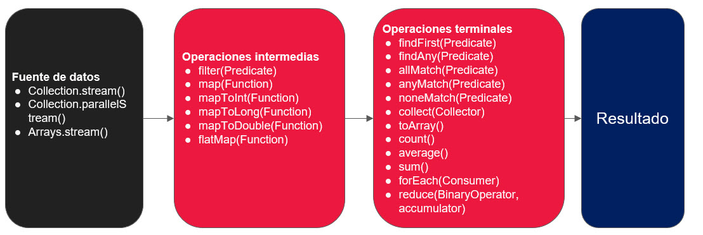
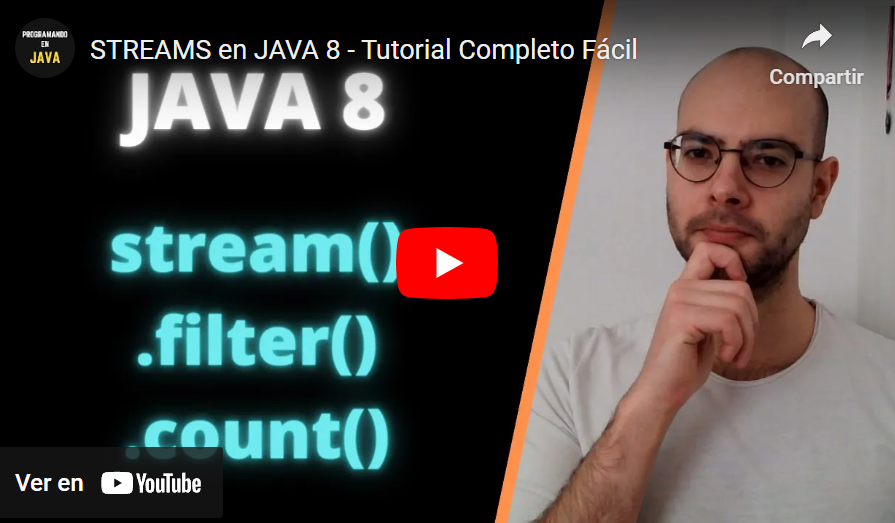

## Temas a tratar

En esta clase se abordarán las siguientes temáticas:

- **Programación Funcional en Java**
    - Streams
    - Optionals

---

## Streams en Java

### Introducción a Streams

En Java, los Streams proporcionan una forma más declarativa y funcional de procesar colecciones de datos. Un Stream es una secuencia de elementos que admite operaciones de procesamiento de datos en colecciones, como filtrado, mapeo y reducción. Los Streams permiten realizar operaciones de manera más concisa y expresiva que con las estructuras de control tradicionales.


### Características clave de Streams

1. **Declarativos:** Los Streams permiten expresar operaciones de procesamiento de datos de manera declarativa, lo que significa que puedes describir qué operación realizar en lugar de cómo hacerlo.
    
2. **Perezosos (Lazy):** Las operaciones en un Stream no se ejecutan hasta que se solicite un resultado. Esto permite la optimización de recursos, ya que solo se procesan los elementos necesarios.
    
3. **Pipelines:** Puedes encadenar varias operaciones en un pipeline para realizar una secuencia de transformaciones en los datos.
    

### Creación de Streams

En Java, hay varias formas de crear Streams:

- **Desde una colección:**

```java
List<String> lista = Arrays.asList("uno", "dos", "tres");
Stream<String> streamDeLista = lista.stream();
```

- **Desde valores individuales:**

```java
Stream<String> streamDeValores = Stream.of("valor1", "valor2", "valor3");
```

- **Mediante generación:**

```java
Stream<Integer> streamDeGeneracion = Stream.iterate(0, n -> n + 2).limit(5);
```

---

## Operaciones comunes en Streams

### Operaciones de filtro

- `filter(Predicate<T> predicate)`: Filtra los elementos del Stream basándose en un predicado.


### Operaciones de transformación

- `map(Function<T, R> mapper)`: Transforma cada elemento del Stream utilizando la función dada.
    
- `flatMap(Function<T, Stream<R>> mapper)`: Transforma cada elemento y aplana el resultado en un solo Stream.


### Operaciones de reducción

- `reduce(BinaryOperator<T> accumulator)`: Combina los elementos del Stream en un solo resultado.


### Operaciones terminales

- `forEach(Consumer<T> action)`: Realiza una acción para cada elemento del Stream.
    
- `collect(Collector<T, A, R> collector)`: Recolecta los elementos del Stream en una estructura de datos.

---

## Ejemplo práctico

Veamos un ejemplo práctico con streams. Supongamos el siguiente escenario:

Imagina que tienes una lista de nombres y deseas filtrar aquellos que tengan más de cierta longitud y luego imprimirlos en mayúsculas

**Tener en cuenta los siguientes criterios:**

- Utiliza Streams para realizar las operaciones de filtrado y transformación.
    
- Imprime los nombres resultantes en mayúsculas en la consola.

**¡Veamos como resolverlo!**

```java
import java.util.Arrays;
import java.util.List;
import java.util.stream.Collectors;

public class EjemploStreams {

    public static void main(String[] args) {
        List<String> nombres = Arrays.asList("Ana", "Juan", "Carlos", "Elena", "Pedro", "Maria");

        List<String> nombresFiltrados = nombres.stream()
                .filter(nombre -> nombre.length() > 4)  // Filtrar nombres con más de 4 caracteres
                .map(String::toUpperCase)  // Convertir a mayúsculas
                .collect(Collectors.toList());  // Recolectar en una lista

        // Imprimir los nombres resultantes
        nombresFiltrados.forEach(System.out::println);
    }
}
```

**¿Qué hacemos en este ejemplo?**

**1.** **Creación de la lista:** Creamos una lista de nombres usando `Arrays.asList()`.

**2.** **Uso de Stream para filtrar y transformar:** Utilizamos un Stream para filtrar los nombres que tienen más de 4 caracteres y luego convertimos cada nombre a mayúsculas.

**3.** **Recolección de resultados:** Utilizamos `collect(Collectors.toList())` para recolectar los resultados en una nueva lista.

**4.** **Impresión de resultados:** Finalmente, utilizamos `forEach(System.out::println)` para imprimir los nombres resultantes.

Este es un caso simple, pero ilustra la potencia y la expresividad de los Streams al realizar operaciones en colecciones de manera más concisa y legible. En aplicaciones más complejas, los Streams pueden ser utilizados para realizar operaciones más avanzadas como mapeo, filtrado condicional, reducción, y mucho más.

---

## Resumen métodos de Streams



---

## Videos explicativos

¡Complementemos nuestra información mediante videos explicativos!

[](https://youtu.be/ACQtz4zpBLE)

[](https://youtu.be/hz6hlaU5o58)

---

## Optionals en Java

### Introducción a Optionals

`Optional` es una clase en Java que se utiliza para representar un valor que puede ser nulo. Su objetivo principal es evitar las excepciones `NullPointerException` al trabajar con valores que podrían ser nulos.


### Características clave de Optionals

1. **Presente o Ausente:** Un `Optional` puede contener un valor o estar vacío.
    
2. **Evita NPE:** Proporciona métodos seguros para acceder y operar sobre valores que podrían ser nulos.
    
3. **Encadenamiento Seguro:** Puedes encadenar operaciones sin preocuparte por valores nulos intermedios.


### Creación de Optionals

- **Creación de un Optional con Valor**

```java
Optional<String> optionalConValor = Optional.of("Este es un valor");
```

- **Creación de un Optional Vacío**

```java
Optional<String> optionalVacio = Optional.empty();
```

- **Creación de un Optional con posibilidad de Valor Nulo**

```java
String valorNullable = // obtener un valor, que podría ser nulo
Optional<String> optionalNullable = Optional.ofNullable(valorNullable);
```


### Operaciones comunes con Optionals

- `isPresent()`: Verifica si el _Optional_ contiene un valor.
    
- `ifPresent(Consumer consumer`): Ejecuta una acción si el _Optional_ contiene un valor.
    
- `orElse(T other)`: Devuelve el valor contenido o un valor predeterminado si está vacío.
    
- `orElseGet(Supplier<? extends T> other)`: Devuelve el valor contenido o el resultado de un proveedor si está vacío.
    
- `orElseThrow(Supplier<? extends X> exceptionSupplier)`: Devuelve el valor contenido o lanza una excepción si está vacío.


### Ejemplo de uso de Streams y Optionals en conjunto

Supongamos que tenemos una lista de Personas y queremos encontrar el nombre de la primera persona cuya edad sea mayor que 25.

```java
List<Persona> personas = // Obtener la lista de personas
String nombrePrimeraPersonaMayorDe25 = personas.stream()
        .filter(p -> p.getEdad() > 25)
        .findFirst()
        .map(Persona::getNombre)
        .orElse("No hay ninguna persona mayor de 25 años");
```

En este ejemplo, `findFirst()` devuelve un _Optional_ que puede contener o no el resultado. Luego, utilizamos `map()` para obtener el nombre si está presente y, finalmente, usamos `orElse()` para proporcionar un valor predeterminado si no se encuentra ninguna persona mayor de 25 años.

---

## Videos explicativos

¡Complementemos nuestra información mediante videos explicativos!

[](https://youtu.be/aUGA7bUTG_0)

[](https://youtu.be/ZqvbRCdZx8M)

[](https://youtu.be/vX-JAs73O9o)


