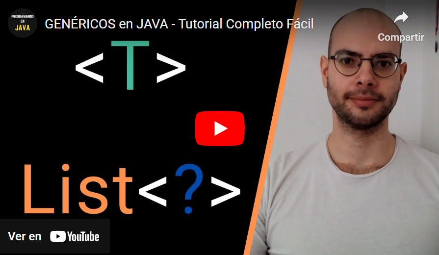
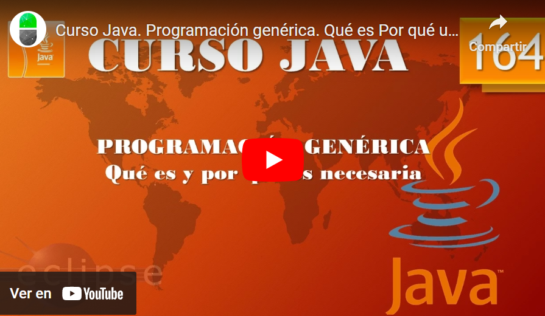

## Temas a tratar

En esta clase se abordarán las siguientes temáticas:

**Utils y Generics en Java**
- Generics
- Utils

---

## Generics en Java

Los **Generics (o genéricos)** en Java son una característica poderosa que permite a los desarrolladores escribir código más flexible y reutilizable. La idea fundamental detrás de los Generics es proporcionar una manera de crear clases, interfaces y métodos que operen con tipos específicos, pero que permitan a los usuarios decidir qué tipo de datos se utilizarán. Esto mejora la seguridad y la legibilidad del código al tiempo que fomenta la reutilización.

---

## Ventajas de usar Generics

1. **Seguridad de Tipos (Type Safety):** Los Generics ofrecen seguridad de tipos en tiempo de compilación, lo que significa que los errores de tipo se detectan antes de que el programa se ejecute.
    
2. **Reutilización de Código:** Permite escribir código que puede trabajar con diferentes tipos de datos, promoviendo la reutilización sin tener que duplicar la lógica del código.
    
3. **Abstracción de Datos:** Permite crear estructuras y algoritmos que son independientes del tipo de datos, proporcionando una mayor abstracción.

---

## Clases y métodos genéricos

```java
public class Caja<T> {
    private T contenido;

    public void ponerContenido(T contenido) {
        this.contenido = contenido;
    }

    public T obtenerContenido() {
        return contenido;
    }
}

// Uso de la clase genérica
Caja<String> cajaDeCadenas = new Caja<>();
cajaDeCadenas.ponerContenido("Hola, soy una cadena");
String contenido = cajaDeCadenas.obtenerContenido();
```

---

## Comodines (Wildcards)

Los comodines en Generics permiten escribir código que puede trabajar con tipos desconocidos. Hay dos tipos de comodines: el comodín sin restricciones (`<?>`) y el comodín con restricciones (`<? extends Tipo>` y `<? super Tipo>`).

### Comodín sin restricciones

```java
public void imprimirLista(List<?> lista) {
    for (Object elemento : lista) {
        System.out.println(elemento);
    }
}
```


### Comodín con restricciones

```java
public <T extends Comparable<T>> T encontrarMaximo(List<T> lista) {
    T maximo = lista.get(0);
    for (T elemento : lista) {
        if (elemento.compareTo(maximo) > 0) {
            maximo = elemento;
        }
    }
    return maximo;
}
```


### Bounded Type Parameters

```java
public class Caja<T extends Fruta> {
    private T contenido;

    // ...
}
```

---

## Uso avanzado de Generics

### Métodos genéricos con parámetros de tipo

```java
public <K, V> boolean compararPares(Pair<K, V> p1, Pair<K, V> p2) {
    return p1.getKey().equals(p2.getKey()) && p1.getValue().equals(p2.getValue());
}
```


### Uso de Generics en Interfaces

```java
public interface Contenedor<T> {
    void agregar(T elemento);
    T obtener(int indice);
}
```

Los Generics en Java proporcionan una forma poderosa y segura de trabajar con tipos de datos de manera flexible y reutilizable. Al entender y aplicar adecuadamente esta característica, los desarrolladores pueden escribir código más robusto y fácilmente adaptable a diferentes situaciones. Recuerda que la correcta aplicación de Generics puede conducir a un código más limpio, menos propenso a errores y más fácil de entender y mantener. ¡Aprovecha al máximo esta herramienta en tu desarrollo en Java!

---

## Ejemplo práctico de Generics

Imagina que estás desarrollando un sistema de gestión de inventario para una tienda en línea que vende diferentes tipos de productos, como electrónicos, ropa y libros. Utilizar Generics puede ser beneficioso en este escenario para manejar de manera eficiente el inventario diverso.

**¡Veamos cómo hacerlo!**

Supongamos que tienes una clase Producto que representa un artículo en el inventario:

```java
public class Producto {
    private String nombre;
    private double precio;

    public Producto(String nombre, double precio) {
        this.nombre = nombre;
        this.precio = precio;
    }

    // Getters y setters
}
```

Luego, puedes crear una clase Inventario que utiliza Generics para gestionar el inventario de manera más general:

```java
import java.util.ArrayList;
import java.util.List;

public class Inventario<T extends Producto> {
    private List<T> productos;

    public Inventario() {
        this.productos = new ArrayList<>();
    }

    public void agregarProducto(T producto) {
        productos.add(producto);
        System.out.println("Producto agregado al inventario: " + producto.getNombre());
    }

    public void mostrarInventario() {
        System.out.println("Inventario:");
        for (T producto : productos) {
            System.out.println(producto.getNombre() + " - $" + producto.getPrecio());
        }
    }

    // Otros métodos relacionados con la gestión del inventario
}
```

Ahora, puedes usar la clase Inventario con diferentes tipos de productos. Por ejemplo:

```java
public class TiendaEnLinea {

    public static void main(String[] args) {
        // Crear inventario para electrónicos
        Inventario<Electronico> inventarioElectronico = new Inventario<>();
        inventarioElectronico.agregarProducto(new Electronico("Laptop", 1200.0, "MarcaX"));
        inventarioElectronico.agregarProducto(new Electronico("Smartphone", 800.0, "MarcaY"));

        // Crear inventario para ropa
        Inventario<Ropa> inventarioRopa = new Inventario<>();
        inventarioRopa.agregarProducto(new Ropa("Camiseta", 20.0, "M", "Algodón"));
        inventarioRopa.agregarProducto(new Ropa("Jeans", 50.0, "32", "Denim"));

        // Crear inventario para libros
        Inventario<Libro> inventarioLibros = new Inventario<>();
        inventarioLibros.agregarProducto(new Libro("Java 101", 29.99, "John Doe"));
        inventarioLibros.agregarProducto(new Libro("Historia del Arte", 39.99, "Jane Smith"));

        // Mostrar inventarios
        inventarioElectronico.mostrarInventario();
        inventarioRopa.mostrarInventario();
        inventarioLibros.mostrarInventario();
    }
}
```

En este ejemplo, Electronico, Ropa, y Libro son subclases de Producto. La clase Inventario se especializa con Generics para aceptar cualquier tipo de producto. Esto facilita la gestión de diferentes inventarios para diferentes categorías de productos, y el código es más genérico y reutilizable.

**¡Veamos un par videos teórico/prácticos para completar todo lo que hemos aprendido!**

[](https://youtu.be/GKJl-4oNUWg)

[](https://youtu.be/MFu8a_LpnIc)

---

## Utilidades comunes en Java (Utils)

Java proporciona un conjunto robusto de utilidades en su biblioteca estándar que facilitan el desarrollo de aplicaciones. Estas utilidades, a menudo agrupadas en clases de utilidad, abarcan desde manipulación de cadenas hasta manejo de fechas, operaciones matemáticas y más. Estas clases se encuentran en el paquete `java.util` y otros paquetes relacionados.


### Clase java.util.Arrays

La clase Arrays proporciona métodos estáticos para trabajar con matrices (arrays) en Java. Algunas operaciones comunes incluyen:

#### Ordenación de Matrices

```java
int[] numeros = {4, 2, 8, 1, 6, 3, 7};
Arrays.sort(numeros);
```

#### Búsqueda en Matrices

```java
int indice = Arrays.binarySearch(numeros, 6);
```

#### Conversión a Cadena

```java
String cadena = Arrays.toString(numeros);
```


### Clase java.util.Collections

La clase Collections proporciona métodos estáticos para operaciones en colecciones, como listas, conjuntos y mapas. Algunas operaciones comunes incluyen:

#### Ordenación de Colecciones

```java
List<String> nombres = Arrays.asList("Ana", "Carlos", "David");
Collections.sort(nombres);
```

#### Búsqueda en Colecciones

```java
int indice = Collections.binarySearch(nombres, "Carlos");
```

#### Inversión de Colecciones

```java
Collections.reverse(nombres);
```


### Clase java.util.StringJoiner

La clase `StringJoiner` facilita la construcción de cadenas concatenando elementos con un delimitador. Por ejemplo:

```java
StringJoiner sj = new StringJoiner(", ", "[", "]");
sj.add("Manzana").add("Banana").add("Cereza");
String resultado = sj.toString();
// Resultado: "[Manzana, Banana, Cereza]"
```


### Clase java.util.StringTokenizer

La clase StringTokenizer se utiliza para dividir una cadena en "tokens" utilizando un delimitador específico. Por ejemplo:

```java
StringTokenizer tokenizer = new StringTokenizer("Java es un lenguaje de programación", " ");
while (tokenizer.hasMoreTokens()) {
    String token = tokenizer.nextToken();
    // Hacer algo con cada token
}
```


### Clase java.util.Date y java.util.Calendar

Las clases Date y Calendar se utilizan para trabajar con fechas y horas en Java. Sin embargo, se recomienda el uso de las nuevas clases introducidas en Java 8 en el paquete java.time, como LocalDate y LocalDateTime, que ofrecen una API más moderna y segura.


### Clase java.util.Random

La clase Random se utiliza para generar números aleatorios. Proporciona métodos para obtener números enteros, números en punto flotante y otros tipos. Por ejemplo:

```java
Random random = new Random();
int numeroAleatorio = random.nextInt(100);  // Genera un número aleatorio entre 0 (inclusive) y 100 (exclusive)
```


### Clase java.util.Scanner

La clase Scanner se utiliza para analizar datos de entrada desde diferentes fuentes, como la entrada estándar o un archivo. Por ejemplo:

```java
Scanner scanner = new Scanner(System.in);
System.out.println("Ingrese su nombre: ");
String nombre = scanner.nextLine();
System.out.println("Hola, " + nombre + "!");
```


### Clase java.util.regex

El paquete java.util.regex proporciona clases para el manejo de expresiones regulares. Puedes utilizar la clase Pattern para compilar expresiones regulares y Matcher para realizar operaciones de coincidencia. Por ejemplo:

```java
Pattern patron = Pattern.compile("[0-9]+");
Matcher matcher = patron.matcher("12345");
boolean esNumero = matcher.matches();  // Devuelve true
```


### Clase java.util.Properties

La clase Properties se utiliza para gestionar propiedades del sistema o configuraciones de la aplicación en forma de pares clave-valor. Por ejemplo:

```java
Properties propiedades = new Properties();
propiedades.setProperty("database.url", "jdbc:mysql://localhost:3306/mi_database");
propiedades.setProperty("usuario", "admin");
// ... Más configuraciones
```

Estas tareas cubren algunas de las utilidades adicionales que Java proporciona para tareas comunes. Puedes explorar más en la documentación oficial de Java para obtener información detallada sobre cada una de estas clases y cómo utilizarlas eficientemente en tus aplicaciones.

---

## Ejemplo práctico Integrador de Utils

Supongamos que tienes una lista de comentarios de usuarios y deseas realizar algunas operaciones en ellos, como contar las palabras más frecuentes y aplicar un filtro para censurar ciertas palabras u operaciones comunes de texto. Utilizaremos algunas clases de utilidades de Java para esto:

```java
import java.util.*;

public class ProcesadorComentarios {

    public static void main(String[] args) {
        // Lista de comentarios de usuarios
        List<String> comentarios = Arrays.asList(
                "Este producto es genial. ¡Lo recomiendo!",
                "No estoy satisfecho con el servicio al cliente.",
                "Increíble oferta. ¡Compré dos!",
                "El envío fue rápido y el producto llegó en perfecto estado.",
                "No recomendaría este producto a nadie."
        );

        // Contar palabras más frecuentes
        Map<String, Integer> frecuenciaPalabras = contarPalabras(comentarios);
        System.out.println("Palabras más frecuentes:");
        frecuenciaPalabras.forEach((palabra, frecuencia) -> System.out.println(palabra + ": " + frecuencia));

        // Censurar ciertas palabras
        List<String> palabrasCensuradas = Arrays.asList("genial", "recomendaría", "rápido", "perfecto");
        List<String> comentariosCensurados = censurarPalabras(comentarios, palabrasCensuradas);
        System.out.println("\nComentarios censurados:");
        comentariosCensurados.forEach(System.out::println);
    }

    // Utilizando la clase java.util.StringTokenizer para contar palabras
    private static Map<String, Integer> contarPalabras(List<String> comentarios) {
        Map<String, Integer> frecuenciaPalabras = new HashMap<>();

        for (String comentario : comentarios) {
            StringTokenizer tokenizer = new StringTokenizer(comentario.toLowerCase(), " .,!?");
            while (tokenizer.hasMoreTokens()) {
                String palabra = tokenizer.nextToken();
                frecuenciaPalabras.put(palabra, frecuenciaPalabras.getOrDefault(palabra, 0) + 1);
            }
        }

        // Ordenar por frecuencia descendente
        return sortByValueDescending(frecuenciaPalabras);
    }

    // Utilizando la clase java.util.Collections para ordenar un Map por valores de forma descendente
    private static <K, V extends Comparable<? super V>> Map<K, V> sortByValueDescending(Map<K, V> map) {
        List<Map.Entry<K, V>> listaEntradas = new ArrayList<>(map.entrySet());
        listaEntradas.sort(Collections.reverseOrder(Map.Entry.comparingByValue()));

        Map<K, V> mapaOrdenado = new LinkedHashMap<>();
        for (Map.Entry<K, V> entrada : listaEntradas) {
            mapaOrdenado.put(entrada.getKey(), entrada.getValue());
        }

        return mapaOrdenado;
    }

    // Utilizando la clase java.util.StringJoiner para censurar palabras
    private static List<String> censurarPalabras(List<String> comentarios, List<String> palabrasCensuradas) {
        List<String> comentariosCensurados = new ArrayList<>();

        for (String comentario : comentarios) {
            StringJoiner joiner = new StringJoiner(" ");
            StringTokenizer tokenizer = new StringTokenizer(comentario, " ");
            while (tokenizer.hasMoreTokens()) {
                String palabra = tokenizer.nextToken();
                if (palabrasCensuradas.contains(palabra.toLowerCase())) {
                    // Censurar la palabra
                    joiner.add("*censurado*");
                } else {
                    joiner.add(palabra);
                }
            }
            comentariosCensurados.add(joiner.toString());
        }

        return comentariosCensurados;
    }
}
```

En este ejemplo:

- Se utiliza `StringTokenizer` para contar las palabras más frecuentes en los comentarios.
    
- Se utiliza `StringJoiner` para censurar palabras específicas en los comentarios.
    
- Se utiliza `Collections.reverseOrder` para ordenar un mapa por sus valores de forma descendente.

---
## Consumer, supplier, predicate y operators

Estos son conceptos clave en el paquete `java.util.function` de Java, que se introdujeron con Java 8 como parte de las expresiones lambda y las funciones de orden superior. Veamos un poco cada uno de ellos:

### Consumer

- La interfaz _Consumer_ representa una operación que toma un argumento de tipo T y no devuelve ningún resultado.
    
- Método que utiliza: `void accept(T t)`: Realiza la operación en el argumento dado.

#### Ejemplo

```java
Consumer<String> imprimirMensaje = mensaje -> System.out.println(mensaje);
imprimirMensaje.accept("Hola, mundo!");
```


### Supplier

- La interfaz _Supplier_ representa un proveedor de resultados de tipo T.
    
- Método que utiliza: `T get()`: Devuelve un resultado de tipo T.
    

#### Ejemplo

```java
Supplier<Double> obtenerNumeroAleatorio = () -> Math.random();
double numeroAleatorio = obtenerNumeroAleatorio.get();
```


### Predicate

- La interfaz Predicate representa una condición que se evalúa en un objeto de tipo T.
    
- Método que utiliza: boolean test(T t): Evalúa la condición en el objeto dado y devuelve true o false.

#### Ejemplo

```java
Predicate<Integer> esPar = numero -> numero % 2 == 0;
boolean resultado = esPar.test(4);  // Devuelve true
```


### Operator

- La interfaz UnaryOperator representa una operación que toma un solo argumento de tipo T y devuelve un resultado de tipo T.
    
- Método que utiliza: T apply(T t): Realiza la operación en el argumento dado y devuelve el resultado.

#### Ejemplo

```java
UnaryOperator<Integer> duplicar = numero -> numero * 2;
int resultado = duplicar.apply(5);  // Devuelve 10
```

Estas interfaces funcionales proporcionan una manera concisa y flexible de expresar comportamientos en forma de funciones, lo que resulta útil en situaciones como el uso de Streams, programación funcional y expresiones lambda en Java.

