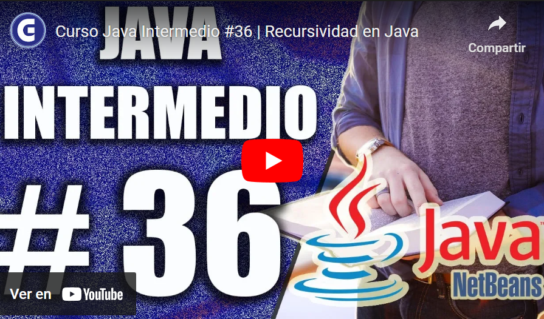
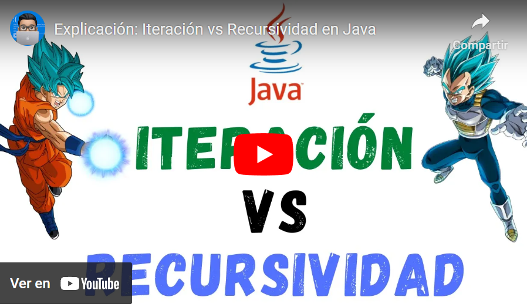
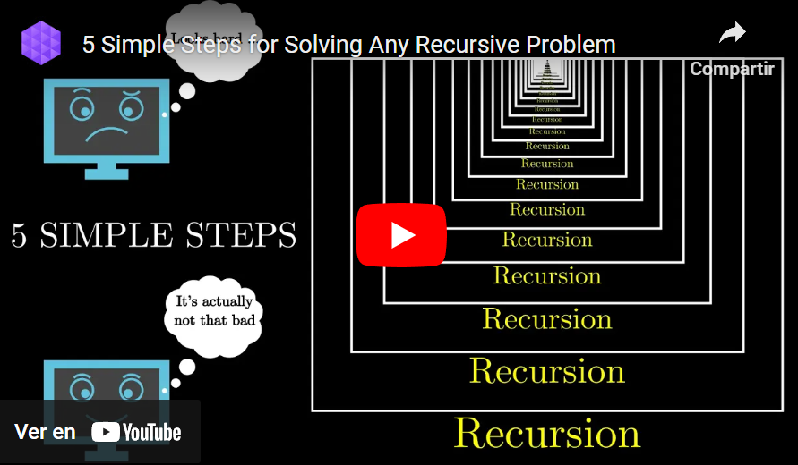

## Temas a tratar

En esta clase se abordarán las siguientes temáticas:

**Recursividad en Java**
- Recursión vs Iteración
- Tipos de recursividad
- Ventajas y desventajas
- Principales problemas de la recursividad

---

## Iteración

La **iteración** es un concepto fundamental en programación que permite ejecutar un bloque de código repetidamente hasta que se cumple una condición o se completa un número específico de repeticiones. En Java, hay varias formas de implementar la iteración, como bucles **for**, **while** y **do-while**.

La iteración no es nada más ni nada menos que lo que estuvimos viendo... "las estructuras repetitivas". Ahora, ¿Existe otra forma de aplicar repeticiones sin utilizar estructuras repetitivas? La respuesta es SI, y ahí entra en juego un concepto llamado "RECURSIVIDAD".

---

## Recursividad

La recursividad es una forma de resolución de problemas en el que una función se llama a sí misma para resolver parte o la totalidad de un problema que se haya planteado.

Se trata de una técnica de programación que permite crear instrucciones que se repitan un número n de veces, por eso se trata de una forma de programación que permite evitar el uso de estructuras de datos repetitivas.

Por ejemplo, una función **sumar()** que suma los números de una lista, puede definirse de manera recursiva de la siguiente manera:

```java
public static int sumar(int[] numeros) {
    if (numeros.length == 0) {
        return 0;
    } else {
        return numeros[0] + sumar(Arrays.copyOfRange(numeros, 1, numeros.length));
    }
}
```

En este caso, la función sumar() se llama a sí misma para sumar los números de la lista, excepto el primero. El caso base es cuando la lista está vacía, en cuyo caso la función devuelve 0. El paso de la recursividad es la suma del primer número de la lista con la llamada recursiva a la función sumar() con el resto de la lista.

Esta función se basa en la siguiente descomposición del problema:

- El problema de sumar los números de una lista se puede dividir en dos subproblemas:
    - Sumar el primer número de la lista.
    - Sumar los números restantes de la lista.
        
- El problema de sumar los números restantes de la lista se puede resolver recursivamente
    

Una de las ventajas de aprender a programar con técnicas recursivas es que esto permite crear códigos complejos con una sintaxis simple y clara. Esto, al final supone un ahorro para el trabajo de los programadores. No obstante, también hay que tener en cuenta que la recursividad en programación Java puede tener el inconveniente de ralentizar el programa que se está desarrollando.

Otro detalle importante sobre la recursividad en programación en Java es que, cada vez que se emplea, por ejemplo, para llamar a una función desde otra función, esto genera una entrada en la pilla de llamadas (estructura dinámica de datos) del programa. Si esto se satura, se produce un error, el _stack overflow_, un fallo en el tiempo de ejecución de las aplicaciones.

**Veamos estos conceptos explicados con un poco más de nivel de detalle en el siguiente video:**

[](https://youtu.be/yX5kR63Dpdw)

### Características de la Recursividad

Entre las principales características de la recursividad nos podemos encontrar con:

- **Llamadas Recursivas:** La recursividad implica que una función se llama a sí misma con argumentos modificados para resolver un subproblema.
    
- **Caso Base:** Cada función recursiva tiene un caso base que indica cuándo detener las llamadas recursivas. Este caso base es fundamental para evitar que la función se llame infinitamente.
    
- **División del Problema:** La idea clave es dividir el problema original en subproblemas más pequeños y resolverlos de manera incremental hasta alcanzar el caso base.


#### Ejemplo complejo

¡Veamos un ejemplo práctico más complejo de recursividad! Supongamos una función para imprimir los contenidos de los nodos de una lista enlazada de manera recursiva

Tenemos una clase Nodo, que representa cada uno de los nodos (elementos) que tiene una lista enlazada:

```java
class Nodo {
    int dato;
    Nodo siguiente;

    Nodo(int dato) {
        this.dato = dato;
        this.siguiente = null;
    }
}
```

Y luego en nuestra clase que contiene el método _main_, otro método para imprimir estos nodos:

```java
public class ListaEnlazada {

    public static void main(String[] args) {
        Nodo cabeza = new Nodo(7);
        cabeza.siguiente = new Nodo(12);
        cabeza.siguiente.siguiente = new Nodo(31);
        cabeza.siguiente.siguiente.siguiente = new Nodo(4);

        System.out.println("Contenido de la lista enlazada:");
        imprimirListaRecursiva(cabeza);
    }

    static void imprimirListaRecursiva(Nodo nodo) {
        if (nodo == null) {
            return; // Caso base: cuando llegamos al final de la lista
        }

        // Imprimimos el dato del nodo actual
        System.out.print(nodo.dato + " ");

        // Llamada recursiva para imprimir el siguiente nodo
        imprimirListaRecursiva(nodo.siguiente);
    }

}
```

Tendríamos una situación, por ejemplo, similar a esta:

```java
   Nodo 1       Nodo 2       Nodo 3       Nodo 4   
+---------+  +---------+  +---------+  +---------+
|  Dato   |  |  Dato   |  |  Dato   |  |  Dato   |
|    7    |  |    12   |  |   31    |  |    4    |
| Sig --> |->| Sig --> |->| Sig --> |->|   NULL  |
+---------+  +---------+  +---------+  +---------+
```

En este ejemplo, la función `imprimirListaRecursiva` toma un nodo de una lista enlazada como argumento. Imprime el dato del nodo actual y luego llama a la misma función para el siguiente nodo en la lista hasta llegar al final (cuando el nodo es _null_), lo que constituye el caso base que detiene la recursión.

#### Veamos otro ejemplo práctico con una explicación complementaria en el siguiente video:

[](https://youtu.be/jEfmotrL7jQ)

---

## Iteración Vs Recursividad

La elección entre **iteración** y **recursividad** es una decisión crucial al diseñar algoritmos en Java. Ambos enfoques ofrecen soluciones para ejecutar tareas repetitivas, pero difieren en su implementación y rendimiento. A continuación, se presenta una tabla comparativa para ayudar a comprender las diferencias clave entre iteración y recursividad en el contexto de Java.

| Característica          | Iteración                                                             | Recursividad                                                                                                        |
| ----------------------- | --------------------------------------------------------------------- | ------------------------------------------------------------------------------------------------------------------- |
| Estructura de control   | Utiliza bucles (for, while, do-while) para repetir código.            | Se basa en llamadas recursivas para repetir la operación.                                                           |
| Mantenimiento de estado | Utiliza variables para rastrear el estado actual y la iteración.      | Utiliza la pila de llamadas para mantener el estado y realizar un seguimiento de las llamadas recursivas.           |
| Eficiencia de memoria   | Puede ser más eficiente en términos de memoria en algunos casos.      | Puede consumir más memoria debido a la pila de llamadas, especialmente en problemas con muchas llamadas recursivas. |
| Eficiencia temporal     | Puede ser más eficiente en términos de tiempo para algunos problemas. | Puede ser menos eficiente en términos de tiempo debido a la sobrecarga de llamadas y la gestión de la pila.         |
| Legibilidad             | Puede ser más explícito y fácil de entender en algunos casos.         | Puede ser más elegante y conciso, pero a veces menos intuitivo para personas no familiarizadas con la recursión.    |

La elección entre iteración y recursividad depende de la naturaleza del problema y de las preferencias del programador. Mientras que la iteración se prefiere a menudo por su eficiencia y simplicidad en Java, la recursividad puede proporcionar soluciones más claras y concisas en ciertos contextos.

**Veamos estas diferencias en mayor detalle en el siguiente video:**

[](https://youtu.be/B2lPfMDZTVI)

---

## Problemas comunes de la recursividad en Java

La recursividad es una técnica poderosa en programación que permite resolver problemas dividiéndolos en casos más simples. Sin embargo, su uso excesivo o inadecuado puede conducir a desafíos específicos en Java. A continuación, veamos algunos de estos problemas comunes asociados con el uso de recursividad en este lenguaje:

- **Consumo excesivo de memoria:** Cada llamada recursiva agrega una nueva entrada a la pila de llamadas. Para problemas con un gran número de llamadas recursivas, puede agotarse la memoria de la pila, lo que resulta en un desbordamiento de pila (**StackOverflowError**).
    
- **Eficiencia en tiempo:** En algunos casos, la recursión puede ser menos eficiente que la iteración debido a la sobrecarga asociada con el mantenimiento de la pila de llamadas.
    
- **Dificultad de seguimiento:** Las llamadas recursivas pueden ser difíciles de rastrear y depurar. Si hay un error en la lógica recursiva, encontrar el punto exacto del error puede resultar complicado.
    
- **Límite de profundidad de la pila:** En Java, la profundidad máxima de la pila de llamadas puede ser limitada. Al realizar llamadas recursivas profundas, se puede alcanzar este límite, provocando un desbordamiento de pila.
    
- **Rendimiento:** En ciertos problemas, la recursión puede ser menos eficiente en términos de rendimiento debido a la sobrecarga de llamadas y a la necesidad de mantener múltiples marcos de pila.
    

Al mismo tiempo, para solucionar algunos de estos problemas, podemos optar por las siguientes estrategias:

- **Optimización:** En algunos casos, se puede convertir una solución recursiva en una solución iterativa para mejorar la eficiencia y reducir el consumo de memoria.
    
- **Uso de bucles:** Cuando sea posible, considera el uso de bucles (iteración) en lugar de la recursión, especialmente en situaciones donde la eficiencia es crucial.
    
- **Caso base claro:** Asegúrate de tener un caso base bien definido para evitar recursiones infinitas y desbordamientos de pila.
    
- **Memoria dinámica:** En situaciones donde se espera una gran cantidad de llamadas recursivas, se puede usar la optimización de cola recursiva (tail recursion) o implementar la recursión con memoria dinámica para reducir el consumo de la pila.
    

Sin dudas existen sin fin de problemas recursivos como así también estrategias para solucionarlos. A continuación, veamos un video que nos propone 5 pasos a tener en cuenta para resolver 3 de los principales tipos de errores recursivos.

[](https://youtu.be/ngCos392W4w)

---

## Ejercicios prácticos de Recursividad

¿Te has quedado con las ganas de practicar ejercicios con Java y Recursividad? Te dejamos una lista de reproducción completa con varios ejercicios con la recursividad como protagonista para que puedas comprender estos conceptos.

**¡Vamos a ello!**

Link a la lista: [https://youtube.com/playlist?list=PLaxZkGlLWHGV5TlkMY6i8bnGqr1VqI814&si=429z1_jHwPLCTmcd](https://youtube.com/playlist?list=PLaxZkGlLWHGV5TlkMY6i8bnGqr1VqI814&si=429z1_jHwPLCTmcd)

