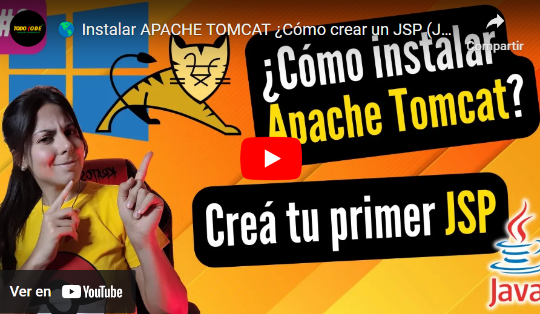

## Temas a abordar

Durante la 3era semana del módulo de Java Avanzado vamos a estar abordando los siguientes temas:

**Introducción al mundo Web**
- Arquitectura Cliente Servidor: Requests y Responses
- Protocolo HTTP.
- Métodos GET y POST

**Creación y gestión de proyectos con Maven**
- ¿Qué es Maven?
- Maven vs Gradle (diferencias y similitudes)
- Creación de un proyecto Java con Maven

**Jakarta EE - ¿Qué es un servidor web?**
- Instalación de Apache Tomcat
- Concepto de Servlets
- Jakarta EE
- Métodos doGet y doPost

**Sistemas Web con JSP + Jakarta EE**
- ¿Qué es JSP?
- Conexión entre JSP, Servlets y lógica de negocio

---

## Conocimientos previos necesarios

Para poder abordar esta semana de manera satisfactoria necesitaremos una serie de conocimientos previos como ser:

- HTML y CSS (básico) y uso de plantillas

- Conceptos de cliente, servidor y protocolo http (con sus métodos). (Esto lo veremos en la teoría del 1er día de la semana 3).

- Instalación de un servidor web (Apache)

Para ello te dejamos el siguiente material complementario para que puedas ponerte a tono:

---

## HTML y CSS

En la siguiente lista de reproducción vas a poder aprender los conceptos básicos de HTML, CSS y uso de plantillas para poder gestionar lo necesario para crear aplicaciones web sencillas mediante JSP con Java.

### HTML y CSS, lista de reproducción completa:

[https://youtube.com/playlist?list=PLQxX2eiEaqbw7lsosVOlAcZBqHPEPO5dc&si=SU00mLQCOwxuSyQJ](https://youtube.com/playlist?list=PLQxX2eiEaqbw7lsosVOlAcZBqHPEPO5dc&si=SU00mLQCOwxuSyQJ)

---

## Instalaciones Necesarias

### Netbeans IDE (Versión 17 + OpenJDK 17 preferiblemente)

- Dadas las cuestiones de licencia que son necesarias para implementar Java/Jakarta EE, utilizaremos un IDE que nos permita la manipulación de estas herramientas y su configuración de forma GRATUITA. En este caso implementaremos Netbeans.
    
- Si no recuerdas cómo instalarlo, puede volver a revisar el paso a paso en el apartado "04. Entorno de Trabajo" del Prebootcamp

### Apache Tomcat

En el siguiente video encontrarás el paso a paso a llevar a cabo para descargar e instalar Apache Tomcat en un proyecto

Utilizaremos la versión 9.0.83 que puedes descargarla en: [https://tomcat.apache.org/download-90.cgi](https://tomcat.apache.org/download-90.cgi) para el sistema operativo que tengas.

**¿Todo listo e instalado?¡Vamos a por esta nueva semana!** 💪🏼🤩