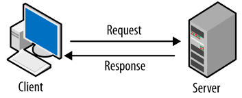
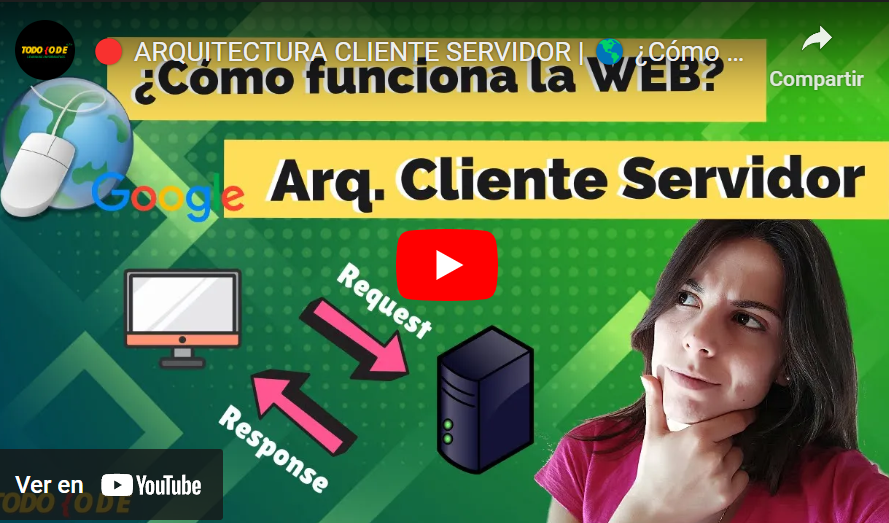
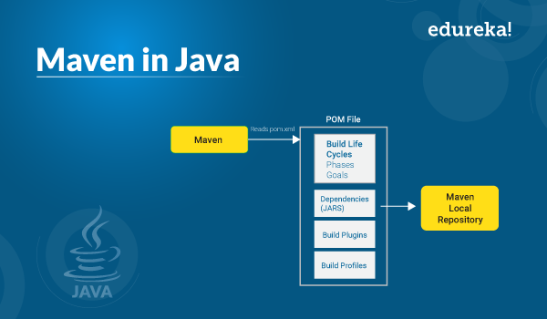
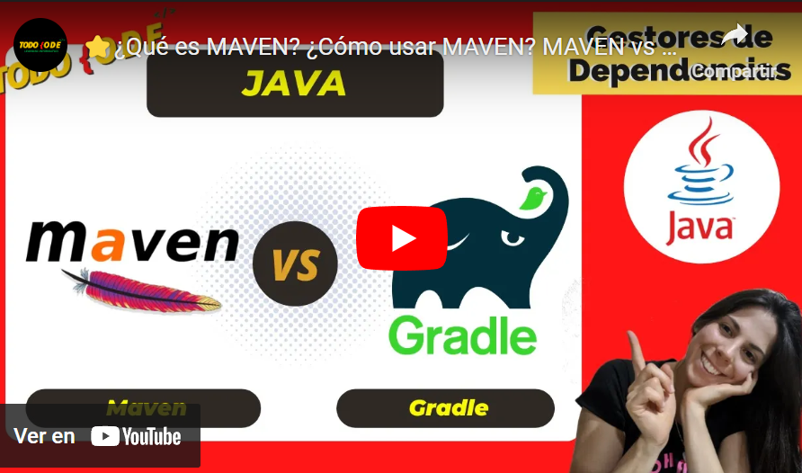
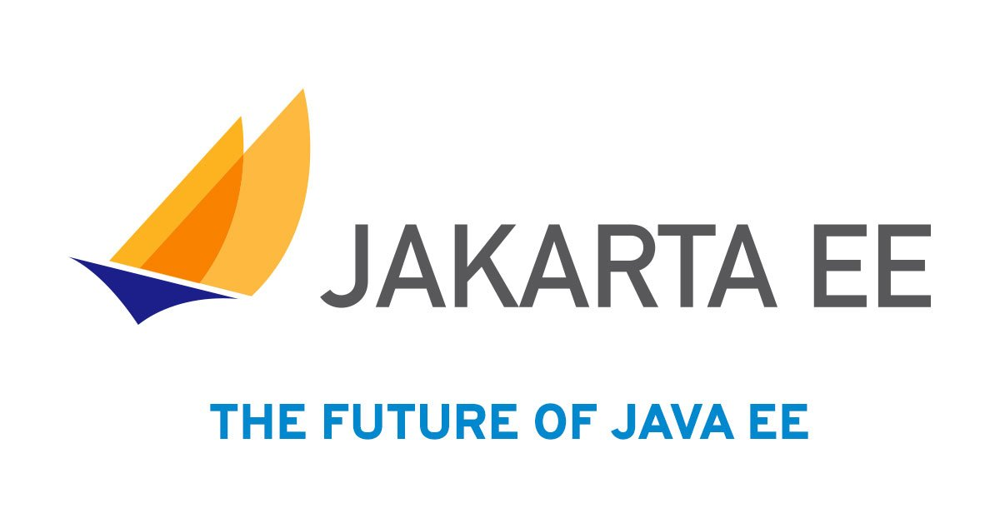
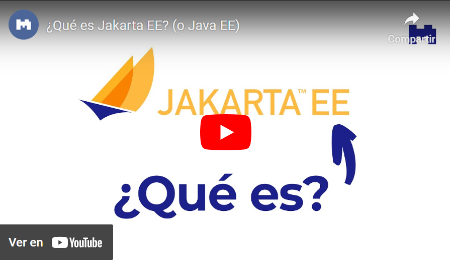
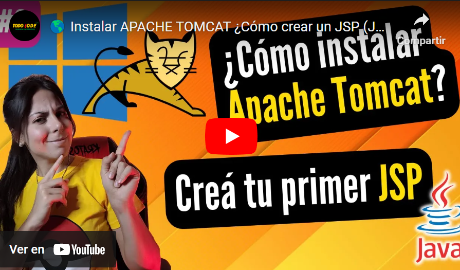
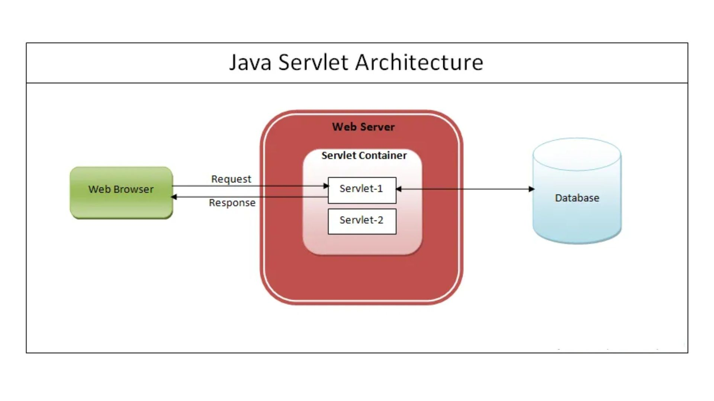
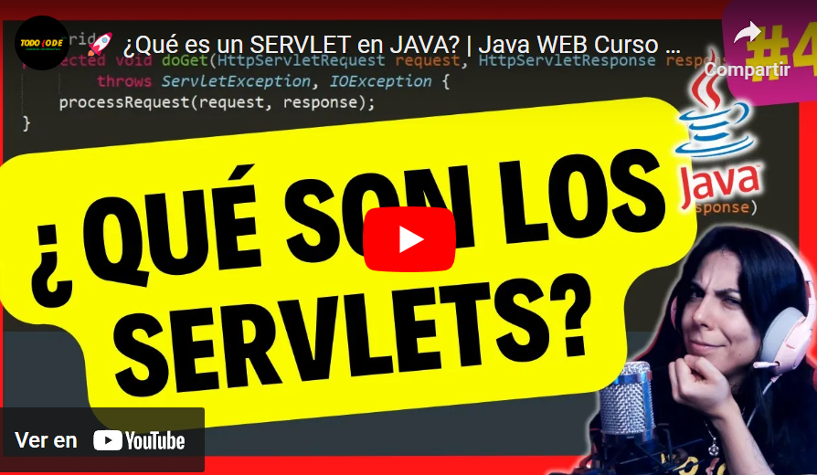

## Temas a tratar

En esta clase se abordarán las siguientes temáticas:

**Introducción al mundo Web**
- Arquitectura Cliente Servidor: Requests y Responses
- Protocolo HTTP. Métodos GET y POST
- Otros métodos HTTP

**Creación y gestión de proyectos con Maven**
- ¿Qué es Maven?
- Maven vs Gradle (diferencias y similitudes)
- Creación de un proyecto Java con Maven

**Java/Jakarta EE**
- ¿Qué es un servidor web?
- Instalación de Apache Tomcat
- Concepto de Servlets

---

## Introducción al mundo web

El **mundo web** es un ecosistema interconectado de recursos digitales accesibles a través de internet. Su génesis se remonta al surgimiento de la **World Wide Web** (WWW) en la década de 1990, concebida por Tim Berners-Lee. Este entorno ha evolucionado desde la presentación estática de información hacia una plataforma dinámica y participativa, integrando aplicaciones, servicios y contenido interactivo.

**Java**, conocido por su portabilidad y robustez, ha sido una opción popular en el desarrollo web. Sus frameworks y herramientas, como **Java Enterprise Edition (Java EE)** y **Spring Framework**, simplifican y agilizan el desarrollo de aplicaciones web.

**Java EE** proporciona un entorno para el desarrollo de aplicaciones empresariales, mientras que Spring Framework ofrece una amplia gama de módulos y funciones que facilitan la creación de aplicaciones robustas y escalables.

El desarrollo web con Java implica el uso de tecnologías como servlets, **JavaServer Pages (JSP)** y APIs específicas. Los servlets son clases Java que extienden las capacidades de un servidor para manejar solicitudes y respuestas web. **JSP**, por otro lado, permite la creación de páginas web dinámicas combinando **HTML** y código Java.

Todos estos conceptos los iremos viendo más adelante, pero a partir de esto, veamos los conceptos básicos que necesitamos comprender para desarrollar web en Java.

---

## Arquitectura Cliente-Servidor

La **arquitectura cliente-servidor** es un modelo de comunicación donde un cliente realiza solicitudes a un servidor, que a su vez proporciona respuestas a esas peticiones. Este modelo define claramente los roles de ambas partes: el cliente inicia la comunicación y el servidor responde a las solicitudes.

### Cliente

Un **cliente** es cualquier dispositivo o programa informático que solicita recursos o servicios a otro programa o dispositivo. En el contexto web, el cliente suele ser un navegador web (como Chrome, Firefox, Safari) o una aplicación que solicita información a un servidor. Cuando un usuario ingresa una URL en un navegador, este actúa como el cliente, enviando una solicitud al servidor para acceder a la página web correspondiente.

El **cliente** inicia la comunicación y envía solicitudes al servidor, generalmente utilizando un protocolo como HTTP. Estas solicitudes pueden ser para obtener páginas web, imágenes, archivos, datos o cualquier otro recurso disponible en el servidor.

### Servidor

Un **servidor** es una computadora u ordenador con un programa informático que proporciona servicios, recursos o datos a otros dispositivos o programas, llamados clientes. En el contexto web, el servidor aloja y gestiona recursos como páginas web, archivos, servicios o aplicaciones. Responde a las solicitudes realizadas por los clientes y les proporciona la información solicitada.

Cuando un cliente envía una solicitud al servidor, este procesa la solicitud, realiza las acciones necesarias y devuelve una respuesta al cliente. Por ejemplo, cuando un navegador solicita una página web, el servidor busca esa página, la procesa (puede incluir bases de datos, lógica de aplicación, etc.) y envía el contenido de vuelta al navegador para que lo muestre al usuario.

A nivel gráfico podemos ver la Arquitectura Cliente-Servidor de la siguiente manera:

**Veamos la arquitectura Cliente-Servidor más a fondo en el siguiente video:**

---

## Protocolo HTTP (Hypertext Transfer Protocol)

Ya entendemos que un cliente se comunica con un servidor pero para esto necesita un lenguaje o forma de comunicación, es ahí donde entra en juego el **Protocolo HTTP**.

El **protocolo HTTP** es la base de la comunicación en la web. Se trata de un protocolo de transferencia de hipertexto que permite la transferencia de datos entre clientes y servidores. Este protocolo opera bajo una arquitectura de solicitud-respuesta sin estado, lo que significa que cada solicitud se trata de manera independiente, sin retener información sobre solicitudes anteriores.

El **protocolo HTTP** se basa principalmente en dos conceptos, en las _requests_ (solicitudes) y las responses (respuestas). Veamos ambas en mayor detalle.

### Request (Solicitud)

Una solicitud (_request_) es un mensaje enviado por un cliente (como un navegador web) a un servidor. Esta solicitud se envía cuando un usuario solicita acceder a una página web, archivo u otro recurso ubicado en el servidor.

**Componentes de una solicitud HTTP:**

- **URL:** Es la dirección del recurso solicitado.
    
- **Método HTTP:** Indica qué acción se desea realizar en el recurso (GET, POST, PUT, DELETE, etc.).
    
- **Encabezados (Headers):** Proporcionan información adicional sobre la solicitud (tipo de navegador, idioma preferido, tipo de contenido, etc.).
    
- **Cuerpo (Body):** Contiene datos adicionales que pueden ser enviados al servidor, por ejemplo, al utilizar el método POST para enviar información de un formulario.

### Response (respuesta)

Una respuesta (response) es lo que el servidor envía de vuelta al cliente como resultado de la solicitud que ha recibido. Contiene la información solicitada o indica el estado de la operación solicitada.

**Componentes de una respuesta HTTP:**

- **Código de Estado (Status Code):** Un número que indica si la solicitud se ha procesado correctamente o si ha habido algún error. Por ejemplo, el código 200 indica éxito, 404 indica que el recurso no fue encontrado, 500 indica un error interno del servidor, entre otros.
    
- **Encabezados (Headers):** Proporcionan información adicional sobre la respuesta (tipo de contenido, longitud del contenido, información sobre el servidor, etc.).
    
- **Cuerpo (Body):** Contiene los datos o el recurso solicitado, como el HTML de una página web, imágenes, archivos, etc.

**¡Veamos al Protocolo HTTP más a fondo en el siguiente video!**

### Métodos GET y POST

**GET y POST** son dos de los métodos principales en HTTP. **GET** se utiliza para solicitar datos del servidor y se representa en la URL del navegador. Es útil para recuperar información y es un método idempotente, es decir, múltiples solicitudes devolverán el mismo resultado.

Por otro lado, **POST** se emplea para enviar datos al servidor. A diferencia de GET, los datos no se exponen en la URL, lo que lo hace adecuado para el envío de información sensible. POST no es idempotente, ya que enviar la misma solicitud puede generar diferentes resultados.

### Otros métodos HTTP

Además de los métodos GET y POST, el protocolo HTTP tiene otros métodos que permiten diferentes tipos de interacciones entre el cliente y el servidor. Algunos de estos métodos comunes son:

**1. PUT**: El método PUT se utiliza para enviar datos al servidor para crear o actualizar un recurso en una ubicación específica. Es similar a POST en el sentido de que también envía datos, pero generalmente se usa para actualizar recursos específicos en una ubicación conocida.

**2. DELETE**: El método DELETE se emplea para solicitar al servidor que elimine un recurso específico. Al enviar una solicitud DELETE a una URL específica, se espera que el servidor elimine el recurso asociado con esa URL.

**3. PATCH**: PATCH se usa para aplicar modificaciones parciales a un recurso. A diferencia de PUT, que actualiza completamente un recurso, PATCH se utiliza para realizar modificaciones parciales o incrementales en el recurso existente.

**4. HEAD**: HEAD es similar a GET, pero en lugar de devolver el cuerpo del recurso solicitado, solo devuelve los encabezados de respuesta. Es útil para obtener metadatos sobre un recurso sin recuperar su contenido completo, lo que puede ser útil para verificar la existencia, la fecha de modificación o los tipos MIME del recurso.

**5. OPTIONS**: OPTIONS se utiliza para obtener información sobre los métodos HTTP permitidos en un recurso en particular. El servidor puede responder con los métodos permitidos, lo que brinda al cliente información sobre qué operaciones son posibles en ese recurso.

**6. TRACE**: TRACE se utiliza principalmente para diagnósticos y pruebas. Cuando se realiza una solicitud TRACE, el servidor devuelve la solicitud que recibió, lo que puede ser útil para la depuración al observar cómo se modifican las solicitudes al pasar por servidores intermedios.

**7. CONNECT:** CONNECT se utiliza para establecer una conexión de red con un servidor, generalmente a través de un proxy. Se utiliza principalmente en la configuración de túneles SSL/TLS a través de un proxy.

Cada uno de estos métodos tiene un propósito específico y se utiliza según las necesidades de interacción entre el cliente y el servidor en una aplicación web.

---

## Creación y gestión de proyectos con Maven

### ¿Qué es Maven?

Maven es una herramienta de gestión y construcción de proyectos de software desarrollada por Apache Software Foundation. Se utiliza para automatizar el proceso de construcción, manejo de dependencias, compilación, pruebas y despliegue de aplicaciones Java y otros lenguajes como C#, Ruby, Scala, etc.

#### Características principales de Maven

Entre las principales características de Maven podemos encontrarnos con:

- **Manejo de dependencias:** Permite gestionar las dependencias de un proyecto de manera eficiente, descargando automáticamente las bibliotecas necesarias desde repositorios remotos.
    
- **Estructura de directorios estandarizada:** Fomenta una estructura de proyecto coherente y fácil de comprender, lo que facilita la colaboración entre desarrolladores.
    
- **Ciclo de vida del proyecto:** Define fases específicas (compilación, pruebas, empaquetado, instalación, despliegue, etc.) que se ejecutan en un orden predefinido para construir y gestionar el proyecto.
    
- **Plugins:** Maven se basa en plugins que amplían sus funcionalidades, permitiendo a los desarrolladores personalizar y ampliar sus procesos de construcción.

#### Funcionamiento de Maven

Maven opera con un enfoque estructurado y predefinido para simplificar la gestión y construcción de proyectos. Su funcionamiento se basa en la configuración centralizada a través del archivo POM (Project Object Model) y en el uso de repositorios para administrar dependencias y plugins. Veamos en detalle cada una de estas partes:

- **Archivo POM (Project Object Model):** Es el núcleo de Maven. Es un archivo XML que describe el proyecto y sus configuraciones, incluyendo dependencias, plugins, versiones, entre otros aspectos.
    
- **Repositorios:** Maven utiliza repositorios para almacenar bibliotecas, dependencias y plugins. Los repositorios pueden ser locales o remotos (como Maven Central).
    
- **Comandos y Ciclo de vida:** Se ejecutan comandos Maven, como mvn compile, mvn test, que activan fases específicas del ciclo de vida del proyecto definido en el POM.

### Maven vs Gradle (diferencias y similitudes)

Maven y Gradle son herramientas de construcción y gestión de proyectos ampliamente utilizadas en el desarrollo de software. Ambas están diseñadas para simplificar tareas como la compilación, pruebas, gestión de dependencias y despliegue, pero difieren en su enfoque y estructura. Sin embargo, tienen ciertas diferencias y similitudes...

**¡Veamos algunas de ellas!**

|Características|Maven|Gradle|
|---|---|---|
|Lenguaje|Basado en XML|Basado en DSL (Groovy o Kotlin)|
|Flexibilidad|Menos flexible, sigue una estructura definida|Altamente flexible, permite personalización|
|Configuración|Define un ciclo de vida predefinido|Permite definir scripts personalizados|
|Gestión de dependencias|Eficiente, pero puede ser rígido|Gestión de dependencias más dinámica|
|Rendimiento|Rápido, pero puede ser menos ágil en proyectos grandes|Considerado más rápido, especialmente en proyectos complejos|
|Curva de aprendizaje|Más fácil para proyectos con convenciones estándar|Más empinada al principio, pero más adaptable a proyectos complejos|

### Creación de un proyecto Java con Maven

**Maven** se ha convertido en un pilar esencial en el ecosistema de desarrollo Java, gracias a su capacidad para gestionar dependencias, automatizar la construcción, y estandarizar la estructura de los proyectos. A continuación, aprenderemos los conceptos clave y las mejores prácticas para utilizar Maven de manera efectiva en tus proyectos creando uno de forma sencilla utilizando Netbeans como IDE.

¡Comencemos a desbloquear el potencial de Maven y llevar tus proyectos Java al siguiente nivel! ¡VAMOS!

### Maven más a fondo

Si bien utilizaremos las herramientas básicas de Maven para descarga de dependencias mediante el POM, no es lo único que podemos hacer realmente con esta potente herramienta, por lo que, si te has quedado con ganas de aprender más, te dejamos la siguiente lista de reproducción a continuación: [https://youtube.com/playlist?list=PLvimn1Ins-40atMWQkxD8r8pRyPLAU0iQ&si=lGHFBc_JGDr8DoHn](https://youtube.com/playlist?list=PLvimn1Ins-40atMWQkxD8r8pRyPLAU0iQ&si=lGHFBc_JGDr8DoHn)

---

## Java y Jakarta EE

**Java EE** (Java Platform, Enterprise Edition) es una plataforma de programación desarrollada por Oracle para construir aplicaciones empresariales en Java. Proporciona un conjunto de especificaciones, APIs y herramientas para simplificar el desarrollo de aplicaciones empresariales escalables, seguras y robustas.

### Características de Java EE

- **Componentes Basados en Contenedores:** Java EE se basa en el concepto de contenedores, que gestionan y proporcionan servicios a los componentes de la aplicación (como Servlets, EJBs, JSPs, etc.).
    
- **Amplia Gama de APIs:** Ofrece APIs para el desarrollo de aplicaciones web, de negocios, acceso a bases de datos, mensajería, seguridad, entre otras.
    
- **Seguridad Integrada:** Proporciona mecanismos de seguridad robustos para autenticación, autorización y gestión de identidades.

### Transición de Java EE a Jakarta EE

**Java EE** era previamente desarrollado y mantenido por Oracle bajo el nombre de J2EE (Java 2 Platform, Enterprise Edition). Posteriormente, se convirtió en Java EE y se hizo popular para el desarrollo de aplicaciones empresariales.

Debido a la necesidad de llevar Java EE a una comunidad de desarrollo más abierta y colaborativa, Oracle transfirió las especificaciones de Java EE a la Eclipse Foundation en 2017. Esto condujo al renombramiento de la plataforma a Jakarta EE.

**Jakarta EE** es una continuación de Java EE con un proceso de desarrollo más comunitario y abierto. Las especificaciones y APIs que solían ser parte de Java EE ahora se están desarrollando y manteniendo bajo el proyecto Jakarta EE.

#### Ventajas y beneficios de Jakarta EE

- **Mayor Involucramiento de la Comunidad:** Jakarta EE fomenta la colaboración de la comunidad de desarrolladores en la evolución de la plataforma.
    
- **Desarrollo de Código Abierto:** Las especificaciones y tecnologías bajo Jakarta EE se desarrollan bajo licencias de código abierto, lo que fomenta la transparencia y la participación.

**¡Veamos Jakarta EE más a fondo en este video!**

---

## ¿Qué es un Servidor Web?

Un **servidor web** no es más que una pc/servidor que cuenta con un software diseñado para atender solicitudes HTTP (Protocolo de Transferencia de Hipertexto) provenientes de clientes, como navegadores web, y enviarles los recursos solicitados, como páginas web, imágenes, archivos, entre otros. Es responsable de manejar el tráfico de internet y distribuir contenido a los usuarios.

Un **servidor web** funciona de la siguiente manera:

1. **Escucha y Responde Solicitudes:** El servidor web está constantemente escuchando por solicitudes HTTP provenientes de los clientes.
    
2. **Procesamiento de Solicitudes:** Una vez que recibe una solicitud, el servidor la procesa, busca el recurso solicitado y prepara la respuesta.
    
3. **Envío de Respuestas:** Envía la respuesta al cliente, ya sea el recurso solicitado (página web, imagen, etc.) o un código de error si el recurso no está disponible.

### Apache Tomcat como Servidor Web para Java

**Apache Tomcat** es un contenedor de servlets y servidor web de código abierto desarrollado por la Apache Software Foundation. Está diseñado para ejecutar aplicaciones web Java Servlet, JavaServer Pages (JSP) y tecnologías relacionadas.

### Características de Apache Tomcat

- **Contenedor de Servlets y JSP:** Tomcat actúa como un contenedor para ejecutar aplicaciones basadas en estas tecnologías.
    
- **Soporte para Especificaciones Java EE:** Implementa las especificaciones de Java EE relacionadas con la capa web, como Servlets, JSP, WebSocket, etc.
    
- **Configuración y Despliegue Sencillos:** Es fácil de configurar y desplegar aplicaciones web en Tomcat.
    
- **Buena Performance:** Ofrece un rendimiento sólido y es ampliamente utilizado en entornos de producción.

### ¿Cómo utilizo Apache Tomcat en Java?

Para utilizar Apache Tomcat en un proyecto Java, es necesario descargarlo desde el sitio web oficial, luego configurarlo y desplegar la aplicación web de forma correcta. Posteriormente, Tomcat se encarga de servir la aplicación web a través de su puerto por defecto (generalmente el puerto 8080).

Repasemos el paso a paso de cómo configurar Apache Tomcat en el IDE Netbeans para poder hacer uso y crear nuestro primer proyecto web.

---

## Servlets

Los **Servlets** son clases Java que se utilizan para ampliar las capacidades de los servidores web y generar respuestas dinámicas a las solicitudes HTTP. Actúan como componentes fundamentales en el desarrollo de aplicaciones web basadas en Java y se ejecutan en el servidor, procesando las solicitudes de los clientes y generando respuestas dinámicas.

### Funcionamiento de los Servlets

Los **servlets** funcionan de la siguiente manera:

- **Manejo de Solicitudes:** Los Servlets reciben y manejan solicitudes HTTP (GET, POST, PUT, DELETE, etc.) enviadas por los clientes (navegadores web, aplicaciones móviles, etc.).
    
- **Generación de Respuestas Dinámicas:** Procesan la solicitud, ejecutan lógica de negocio, acceden a bases de datos o a otros recursos y generan respuestas dinámicas, generalmente en formato HTML, XML o JSON.
    
- **Interacción con Ciclo de Vida del Servlet:** Los Servlets tienen un ciclo de vida que incluye métodos como `init()`, `service()`, `doGet()`, `doPost()`, `destroy()`, que se ejecutan en diferentes etapas del ciclo de vida del Servlet.

### Creando un Servlet

Los **Servlets** son una parte fundamental del desarrollo de aplicaciones web Java y ofrecen un enfoque poderoso y flexible para manejar solicitudes HTTP y generar respuestas dinámicas en el entorno del servidor.

**¡Veamos en detalle cómo crear uno!**

### Pasando datos a un servlet

Ya sabemos cómo crear un servlet, ahora veamos cómo podemos pasar datos a uno en el siguiente video:

### Traer datos desde un servlet

Ya sabemos cómo enviar datos a un servlet, ahora, veamos cómo podemos obtener los mismos mediante el método Get y solicitudes. ¡Vamos a eso!

