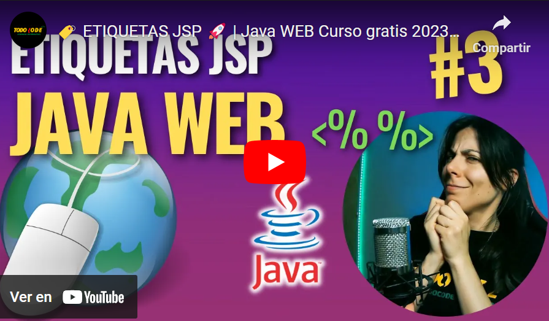
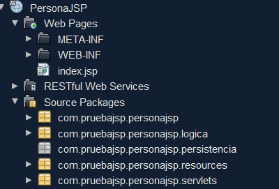
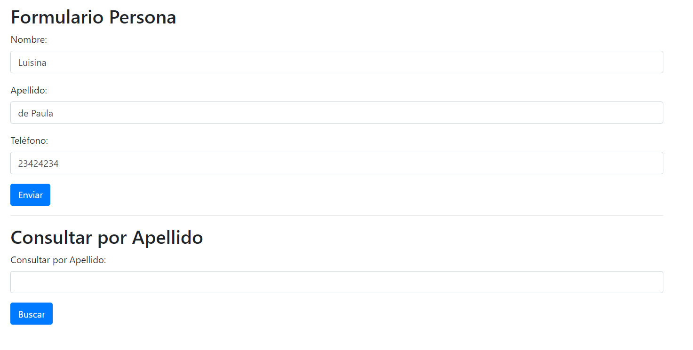
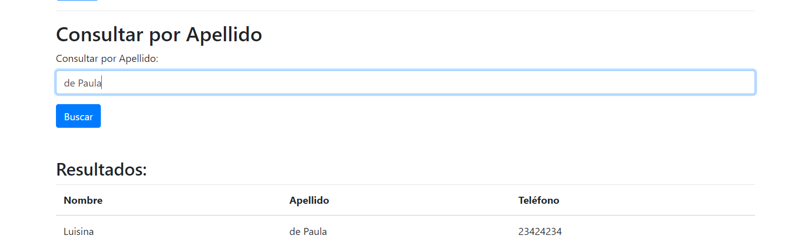
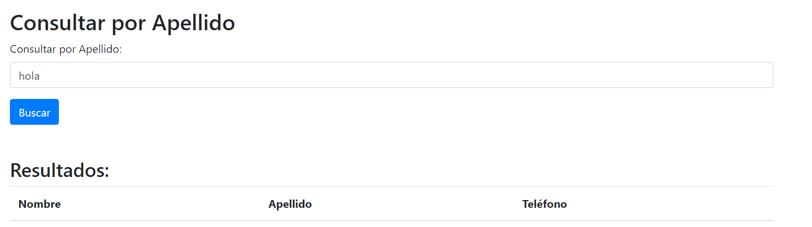
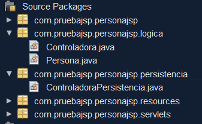
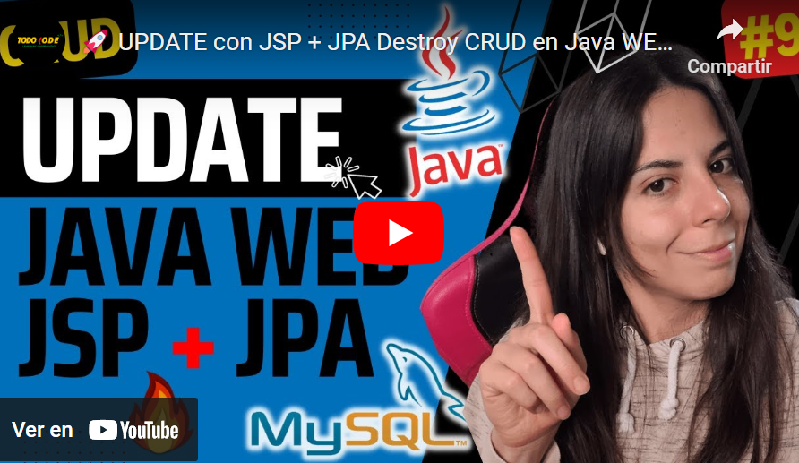

## Temas a tratar

En esta clase se abordarán las siguientes temáticas:

**Sistemas Web con JSP + Jakarta EE**
- ¿Qué es JSP?
- Conexión entre JSP, Servlets y lógica de negocio    
- JSP + JPA

---

## ¿Qué es JSP?

JSP, o JavaServer Pages, es una tecnología utilizada en el desarrollo web que permite la creación de páginas web dinámicas basadas en Java. Proporciona una forma de crear contenido web que combina HTML, XML o algún otro tipo de marcado, con código Java para generar contenido dinámico.

[](https://youtu.be/dm0stmK5egM)

### Características de JSP

- **Mezcla de Contenido Estático y Dinámico:** Permite la integración de código Java dentro del código HTML para generar contenido dinámico en las páginas web.
    
- **Facilidad de Uso:** Al estar basado en HTML y tener sintaxis similar, resulta más sencillo para los desarrolladores web trabajar con JSP.
    
- **Reutilización de Componentes:** Permite la creación de componentes reutilizables (llamados fragmentos o tags) que pueden ser utilizados en múltiples páginas.
    
- **Interacción con JavaBeans:** Facilita la interacción con JavaBeans, objetos Java reutilizables que contienen lógica de negocio, permitiendo separar la lógica de la presentación.
    
- **Dinamismo y Flexibilidad:** Puede adaptarse a distintos tipos de contenido dinámico como formularios, acceso a bases de datos, entre otros.


### Etiquetas JSP

En el desarrollo web con Java, las JavaServer Pages (JSP) son un componente fundamental para crear aplicaciones web dinámicas. Las etiquetas en JSP son elementos clave que permiten integrar lógica de programación en las páginas web, combinando el poder de Java con la facilidad del marcado HTML. En esta sección, exploraremos una serie de etiquetas esenciales que desempeñan roles específicos en la construcción de aplicaciones web dinámicas con JSP.

La tabla a continuación detalla algunas de las etiquetas más utilizadas en JSP junto con su funcionalidad y ejemplos de uso. Estas etiquetas abarcan desde la inclusión de contenido hasta la manipulación de objetos Java y la configuración de páginas, permitiendo a los desarrolladores crear aplicaciones web interactivas y escalables.

| Etiqueta              | Uso                                                                                         | Ejemplo                                                            |
| --------------------- | ------------------------------------------------------------------------------------------- | ------------------------------------------------------------------ |
| <% %>                 | Scriptlet: Incluye código Java en el JSP.                                                   | <% int x = 10; %>                                                  |
| <%= %>                | Expresión: Evalúa una expresión Java en el JSP.                                             | <%= "Hello, " + usuario.getNombre() + "!" %>                       |
| <%-- --%>             | Comentario: Comenta bloques de código en el JSP.                                            | <%-- Este es un comentario en JSP --%>                             |
| <%@ %>                | Directiva: Define configuraciones para la página JSP.                                       | <%@ page language="java" contentType="text/html; charset=UTF-8" %> |
| <%! %>                | Declaración: Permite definir variables y métodos globales en la clase del servlet generado. | <%! public static final int CONSTANTE = 100; %>                    |
| jsp:directive.include | Incluye contenido de otro recurso durante la fase de compilación.                           | <jsp:directive.include file="header.jsp" />                        |
| jsp:useBean           | Crea o localiza un objeto JavaBean.                                                         | <jsp:useBean id="usuario" class="com.example.Usuario" />           |
| jsp:setProperty       | Establece propiedades de un JavaBean.                                                       | <jsp:setProperty name="usuario" property="nombre" value="John" />  |
| jsp:getProperty       | Obtiene propiedades de un JavaBean.                                                         | <jsp:getProperty name="usuario" property="nombre" />               |
| jsp:include           | Incluye el resultado de otro recurso en el JSP.                                             | <jsp:include page="footer.jsp" />                                  |

Veamos a continuación un ejemplo práctico de uso de cada una de estas etiquetas:

[](https://youtu.be/QTzslCjvN_I)

### Hagamos un pequeño proyecto

Ya teniendo algunos conceptos básicos de HTML, CSS y el uso de plantillas + los nuevos conocimientos adquiridos sobre JSP, servlets y sus correspondientes etiquetas, ya estamos en condiciones de poder llevar a cabo a contiuación un formulario de ejemplo de registro de personas en una lista. ¡Veamos el paso a paso de cómo hacerlo!

**Paso 1:** Creamos utilizando Maven un nuevo proyecto web al que llamaremos PersonasJsp. Eliminamos el archivo index.html con el que viene por defecto y creamos la estructura de nuestros paquetes para respetar el modelo de capas de la siguiente manera:



Como se puede ver, tenemos un paquete para la lógica y modelado, otro para la futura persistencia y otro para los servlets.

**Paso 2:** Iremos a nuestro **POM.xml** y revisaremos las versiones con las que estemos trabajando, sobre todo en el plugin de Maven (para evitar errores de compatibilidad). Recordemos que la versión del plugin de Maven debe estar en la 3.3.2. A continuación te dejamos un pom.xml de referencia:

```java
<project xmlns="http://maven.apache.org/POM/4.0.0" xmlns:xsi="http://www.w3.org/2001/XMLSchema-instance"
         xsi:schemaLocation="http://maven.apache.org/POM/4.0.0 http://maven.apache.org/xsd/maven-4.0.0.xsd">
    <modelVersion>4.0.0</modelVersion>
    <groupId>com.pruebajsp</groupId>
    <artifactId>PersonaJSP</artifactId>
    <version>1.0-SNAPSHOT</version>
    <packaging>war</packaging>
    <name>PersonaJSP</name>
    
    <properties>
        <maven.compiler.source>1.8</maven.compiler.source>
        <maven.compiler.target>1.8</maven.compiler.target>
        <endorsed.dir>${project.build.directory}/endorsed</endorsed.dir>
        <project.build.sourceEncoding>UTF-8</project.build.sourceEncoding>
        <failOnMissingWebXml>false</failOnMissingWebXml>
        <jakartaee>8.0.0</jakartaee>
    </properties>
    
    <dependencies>
        <dependency>
            <groupId>jakarta.platform</groupId>
            <artifactId>jakarta.jakartaee-api</artifactId>
            <version>${jakartaee}</version>
            <scope>provided</scope>
        </dependency>
    </dependencies>
    
     <build>
        <plugins>
            <plugin>
                <groupId>org.apache.maven.plugins</groupId>
                <artifactId>maven-compiler-plugin</artifactId>
                <version>3.1</version>
                <configuration>
                    <source>1.8</source>
                    <target>1.8</target>
                    <compilerArguments>
                        <endorseddirs>${endorsed.dir}</endorseddirs>
                    </compilerArguments>
                </configuration>
            </plugin>
            <plugin>
                <groupId>org.apache.maven.plugins</groupId>
                <artifactId>maven-war-plugin</artifactId>
                <version>3.3.2</version> <!-- Modificación en la versión -->
                <configuration>
                    <failOnMissingWebXml>false</failOnMissingWebXml>
                </configuration>
            </plugin>
            <plugin>
                <groupId>org.apache.maven.plugins</groupId>
                <artifactId>maven-dependency-plugin</artifactId>
                <version>2.6</version>
                <executions>
                    <execution>
                        <phase>validate</phase>
                        <goals>
                            <goal>copy</goal>
                        </goals>
                        <configuration>
                            <outputDirectory>${endorsed.dir}</outputDirectory>
                            <silent>true</silent>
                            <artifactItems>
                                <artifactItem>
                                    <groupId>jakarta.platform</groupId>
                                    <artifactId>jakarta.jakartaee-api</artifactId>
                                    <version>${jakartaee}</version>
                                    <type>jar</type>
                                </artifactItem>
                            </artifactItems>
                        </configuration>
                    </execution>
                </executions>
            </plugin>
        </plugins>
    </build>
</project>
```

**Paso 3:** En nuestro paquete lógica crearemos la siguiente clase Persona:

```java
public class Persona {
    private String nombre;
    private String apellido;
    private String telefono;

    // Constructor, getters y setters

    public Persona() {
    }

    public Persona(String nombre, String apellido, String telefono) {
        this.nombre = nombre;
        this.apellido = apellido;
        this.telefono = telefono;
    }

    public String getNombre() {
        return nombre;
    }

    public void setNombre(String nombre) {
        this.nombre = nombre;
    }

    public String getApellido() {
        return apellido;
    }

    public void setApellido(String apellido) {
        this.apellido = apellido;
    }

    public String getTelefono() {
        return telefono;
    }

    public void setTelefono(String telefono) {
        this.telefono = telefono;
    }
}
```

**Paso 4:** Crearemos nuestro index.jsp para que sea nuestra página principal. Para ello, en este ejemplo utilizaremos:

- Un formulario HTML para la recolección de los datos del usuario con un botón enviar que llevará esos datos mediante una request al servlet para que sean guardados como una nueva persona en una lista.
    
- Un campo de texto donde podremos buscar a las personas por apellido, con un botón buscar.
    
    - En caso de que encuentre las personas, las mostrará en una tabla con sus respectivos datos.
        
    - En caso de no encontrar, la tabla se mostrará vacía.
        
- Para dar un poco de estilos utilizaremos CSS y Bootstrap (puedes utilizar las herramientas que prefieras).
    

Dejamos a continuación un ejemplo de JSP con estilos simples y utilizando las etiquetas Java correspondientes para mostrar datos en la tabla:

```java
<%@page import="java.util.ArrayList"%>
<%@page import="com.pruebajsp.personajsp.logica.Persona"%>
<%@page contentType="text/html" pageEncoding="UTF-8"%>
<!DOCTYPE html>
<html lang="en">
<head>
    <meta charset="UTF-8">
    <title>Formulario Persona</title>
    <!-- Agregar estilos de Bootstrap -->
    <link rel="stylesheet" href="https://maxcdn.bootstrapcdn.com/bootstrap/4.5.2/css/bootstrap.min.css">
</head>
<body>
    <div class="container mt-4">
        <h2>Formulario Persona</h2>
        <form action="PersonaSv" method="post">
            <div class="form-group">
                <label for="nombre">Nombre:</label>
                <input type="text" class="form-control" id="nombre" name="nombre">
            </div>
            <div class="form-group">
                <label for="apellido">Apellido:</label>
                <input type="text" class="form-control" id="apellido" name="apellido">
            </div>
            <div class="form-group">
                <label for="telefono">Teléfono:</label>
                <input type="text" class="form-control" id="telefono" name="telefono">
            </div>
            <button type="submit" class="btn btn-primary">Enviar</button>
        </form>

        <hr>

        <h2>Consultar por Apellido</h2>
        <form action="PersonaSv" method="get">
            <div class="form-group">
                <label for="consultaApellido">Consultar por Apellido:</label>
                <input type="text" class="form-control" id="consultaApellido" name="consultaApellido">
            </div>
            <button type="submit" class="btn btn-primary">Buscar</button>
        </form>
   
    <br>
    <br>
    <!-- Resultados en tabla -->
    <div class="results-table">
        <% if (request.getAttribute("resultados") != null) { %>
            <h3>Resultados:</h3>
            <table class="table">
                <thead>
                    <tr>
                        <th>Nombre</th>
                        <th>Apellido</th>
                        <th>Teléfono</th>
                    </tr>
                </thead>
                <tbody>
                    <% for (Persona persona : (ArrayList<Persona>) request.getAttribute("resultados")) { %>
                        <tr>
                            <td><%= persona.getNombre() %></td>
                            <td><%= persona.getApellido() %></td>
                            <td><%= persona.getTelefono() %></td>
                        </tr>
                    <% } %>
                </tbody>
            </table>
        <% } %>
    </div>
 </div>
    <!-- Scripts de Bootstrap -->
    <script src="https://maxcdn.bootstrapcdn.com/bootstrap/4.5.2/js/bootstrap.min.js"></script>
    <script src="https://ajax.googleapis.com/ajax/libs/jquery/3.5.1/jquery.min.js"></script>
</body>
</html>
```

>💡 Recuerda que NO ES NECESARIO QUE SEAS EXPERTO EN FRONTEND para realizar estos ejemplos. Puedes utilizar plantillas pre-hechas y únicamente agregar el código Java correspondiente con sus respectivas etiquetas.

**Paso 5:** Una vez listo nuestro jsp y nuestra clase persona, llevaremos a cabo el respectivo servlet que llamaremos: **PersonasSV**. Para ello tendremos en cuenta lo siguiente:

- El método **`doPost()`** recibirá las peticiones del JSP mediante el método POST para dar de alta nuevas personas a partir de los datos que recolecte desde el formulario de nuestro JSP. El alta se hará de forma lógica en una lista (no utilizaremos aún bases de datos).
    
- El método **`doGet()`** devolverá las personas contenidas en la lista que cumplan con el apellido que haya sido solicitado para luego mostrarlo en la tabla.

Te dejamos a continuación, código de referencia:

```java
package com.pruebajsp.personajsp.servlets;

import com.pruebajsp.personajsp.logica.Persona;
import java.io.*;
import java.util.ArrayList;
import javax.servlet.ServletException;
import javax.servlet.annotation.WebServlet;
import javax.servlet.http.*;

@WebServlet("/PersonaSv") // Esta anotación define la ruta del servlet
public class PersonaSv extends HttpServlet {
    private ArrayList<Persona> listaPersonas = new ArrayList<>();

    protected void doPost(HttpServletRequest request, HttpServletResponse response) throws ServletException, IOException {
        String nombre = request.getParameter("nombre");
        String apellido = request.getParameter("apellido");
        String telefono = request.getParameter("telefono");

        Persona persona = new Persona();
        persona.setNombre(nombre);
        persona.setApellido(apellido);
        persona.setTelefono(telefono);

        listaPersonas.add(persona);

        // Aquí podrías guardar la lista en algún lugar persistente (base de datos, archivo, etc.)
        // Por simplicidad, se guarda en memoria durante la ejecución del servlet

        response.sendRedirect("index.jsp");
    }

    protected void doGet(HttpServletRequest request, HttpServletResponse response) throws ServletException, IOException {
        String consultaApellido = request.getParameter("consultaApellido");

        ArrayList<Persona> personasCoincidentes = new ArrayList<>();

        for (Persona persona : listaPersonas) {
            if (persona.getApellido().equalsIgnoreCase(consultaApellido)) {
                personasCoincidentes.add(persona);
            }
        }

        // Establecer los resultados en la solicitud para que se muestren en el JSP
        request.setAttribute("resultados", personasCoincidentes);

        // Redirigir de vuelta al formulario
        request.getRequestDispatcher("index.jsp").forward(request, response);
        
    }
}
```

💡Como verás hay una nueva **annotation** en este caso y se trata de **@WebServlet**. Ésta se utiliza para indicar el path donde se encontrará nuestro servlet en cuestión (dado que en el formulario del JSP debemos indicar esto en el apartado “action”. Recuerda que ambos nombres deben coincidir)

**Paso 6:** Con todo esto configurado y listo, estamos en condiciones de ejecutar nuestro programa. En este caso obtendremos algo similar a esto:

**a.** Agregamos “Luisina de Paula” (o la persona que quieran) mediante el formulario de carga:



**b.** Una vez cargado, buscamos por el apellido y si todo sale bien, obtenemos la tabla de resultados:



**c.** En caso de que no haya coincidencias con el apellido consultado, la tabla deberá permanecer vacía:



**¿Pudiste seguir el paso a paso? De ser así ya estás listo para hacer tus propios formularios mediante JSP** 🤩

---

## JPA + JSP

Ya logramos interconectar 3 capas de nuestra aplicación: La **IGU** mediante **JSP**, los **servlets** (que son intermediarios) y nuestro **modelado lógico**. Ahora llegó el momento de agregar una capa más a nuestro sistema, la capa de **PERSISTENCIA** y lo haremos mediante JPA.

Tomaremos como base el proyecto del formulario JSP que acabamos de llevar a cabo y le agregaremos JPA para que en lugar de utilizar una BD Lógica (la lista) utilicemos una BD real.

**Paso 1:** Crearemos nuestra base de datos. En este caso colocaremos el nombre `personasjsp` (pueden colocar el nombre que quieran).

**Paso 2:** Agregaremos a nuestra clase persona el campo id (modificaremos el constructor, _getters_ y _setters_ en base a esto) y haremos los correspondientes mapeos mediante _annotations_, quedando de la siguiente manera:

```java
package com.pruebajsp.personajsp.logica;

import javax.persistence.Entity;
import javax.persistence.GeneratedValue;
import javax.persistence.GenerationType;
import javax.persistence.Id;

@Entity
public class Persona {
    @Id
    @GeneratedValue(strategy = GenerationType.IDENTITY)
    private Long id;
    private String nombre;
    private String apellido;
    private String telefono;

    public Persona() {
    }

    public Persona(Long id, String nombre, String apellido, String telefono) {
        this.id = id;
        this.nombre = nombre;
        this.apellido = apellido;
        this.telefono = telefono;
    }

    public Long getId() {
        return id;
    }

    public void setId(Long id) {
        this.id = id;
    }

    public String getNombre() {
        return nombre;
    }

    public void setNombre(String nombre) {
        this.nombre = nombre;
    }

    public String getApellido() {
        return apellido;
    }

    public void setApellido(String apellido) {
        this.apellido = apellido;
    }

    public String getTelefono() {
        return telefono;
    }

    public void setTelefono(String telefono) {
        this.telefono = telefono;
    }   
}
```

**Paso 3:** Crearemos nuestras clases **Controladora** y **ControladoraPersistencia** respectivamente en sus paquetes:



De igual manera creamos nuestra **conexión a la BD**, creamos la **Unidad de Persistencia** y asociamos a nuestra clase **Persona** ya mapeada a la misma:

> **persistence.xml**
```javascript
<?xml version="1.0" encoding="UTF-8"?>
<persistence version="2.2" xmlns="http://xmlns.jcp.org/xml/ns/persistence" xmlns:xsi="http://www.w3.org/2001/XMLSchema-instance" xsi:schemaLocation="http://xmlns.jcp.org/xml/ns/persistence http://xmlns.jcp.org/xml/ns/persistence/persistence_2_2.xsd">
  <persistence-unit name="personaJspPU" transaction-type="RESOURCE_LOCAL">
    <provider>org.eclipse.persistence.jpa.PersistenceProvider</provider>
    <class>com.pruebajsp.personajsp.logica.Persona</class>
    <exclude-unlisted-classes>false</exclude-unlisted-classes>
    <properties>
      <property name="javax.persistence.jdbc.url" value="jdbc:mysql://localhost:3306/personasjsp?serverTimezone=UTC"/>
      <property name="javax.persistence.jdbc.user" value="root"/>
      <property name="javax.persistence.jdbc.driver" value="com.mysql.cj.jdbc.Driver"/>
      <property name="javax.persistence.jdbc.password" value=""/>
      <property name="javax.persistence.schema-generation.database.action" value="create"/>
    </properties>
  </persistence-unit>
</persistence>
```

**Paso 4:** Crearemos nuestro **JpaController** para **Persona** (con su constructor):

```java
package com.pruebajsp.personajsp.persistencia;

import com.pruebajsp.personajsp.logica.Persona;
import com.pruebajsp.personajsp.persistencia.exceptions.NonexistentEntityException;
import java.io.Serializable;
import java.util.List;
import javax.persistence.EntityManager;
import javax.persistence.EntityManagerFactory;
import javax.persistence.Query;
import javax.persistence.EntityNotFoundException;
import javax.persistence.Persistence;
import javax.persistence.criteria.CriteriaQuery;
import javax.persistence.criteria.Root;

/**
 *
 * @author Luisina
 */
public class PersonaJpaController implements Serializable {

    public PersonaJpaController(EntityManagerFactory emf) {
        this.emf = emf;
    }

    private EntityManagerFactory emf = null;

    public PersonaJpaController() {
        emf = Persistence.createEntityManagerFactory("personajspPU");
    }

    public EntityManager getEntityManager() {
        return emf.createEntityManager();
    }

    public void create(Persona persona) {
        EntityManager em = null;
        try {
            em = getEntityManager();
            em.getTransaction().begin();
            em.persist(persona);
            em.getTransaction().commit();
        } finally {
            if (em != null) {
                em.close();
            }
        }
    }

    public void edit(Persona persona) throws NonexistentEntityException, Exception {
        EntityManager em = null;
        try {
            em = getEntityManager();
            em.getTransaction().begin();
            persona = em.merge(persona);
            em.getTransaction().commit();
        } catch (Exception ex) {
            String msg = ex.getLocalizedMessage();
            if (msg == null || msg.length() == 0) {
                Long id = persona.getId();
                if (findPersona(id) == null) {
                    throw new NonexistentEntityException("The persona with id " + id + " no longer exists.");
                }
            }
            throw ex;
        } finally {
            if (em != null) {
                em.close();
            }
        }
    }

    public void destroy(Long id) throws NonexistentEntityException {
        EntityManager em = null;
        try {
            em = getEntityManager();
            em.getTransaction().begin();
            Persona persona;
            try {
                persona = em.getReference(Persona.class, id);
                persona.getId();
            } catch (EntityNotFoundException enfe) {
                throw new NonexistentEntityException("The persona with id " + id + " no longer exists.", enfe);
            }
            em.remove(persona);
            em.getTransaction().commit();
        } finally {
            if (em != null) {
                em.close();
            }
        }
    }

    public List<Persona> findPersonaEntities() {
        return findPersonaEntities(true, -1, -1);
    }

    public List<Persona> findPersonaEntities(int maxResults, int firstResult) {
        return findPersonaEntities(false, maxResults, firstResult);
    }

    private List<Persona> findPersonaEntities(boolean all, int maxResults, int firstResult) {
        EntityManager em = getEntityManager();
        try {
            CriteriaQuery cq = em.getCriteriaBuilder().createQuery();
            cq.select(cq.from(Persona.class));
            Query q = em.createQuery(cq);
            if (!all) {
                q.setMaxResults(maxResults);
                q.setFirstResult(firstResult);
            }
            return q.getResultList();
        } finally {
            em.close();
        }
    }

    public Persona findPersona(Long id) {
        EntityManager em = getEntityManager();
        try {
            return em.find(Persona.class, id);
        } finally {
            em.close();
        }
    }

    public int getPersonaCount() {
        EntityManager em = getEntityManager();
        try {
            CriteriaQuery cq = em.getCriteriaBuilder().createQuery();
            Root<Persona> rt = cq.from(Persona.class);
            cq.select(em.getCriteriaBuilder().count(rt));
            Query q = em.createQuery(cq);
            return ((Long) q.getSingleResult()).intValue();
        } finally {
            em.close();
        }
    }

}
```

Luego crearemos la instancia en nuestra **ControladoraPersistencia** y haremos también referencia a cada método del **CRUD** que nos ofrece **JPA**:

```java
package com.pruebajsp.personajsp.persistencia;

import com.pruebajsp.personajsp.logica.Persona;
import com.pruebajsp.personajsp.persistencia.exceptions.NonexistentEntityException;
import java.util.List;
import java.util.logging.Level;
import java.util.logging.Logger;

public class ControladoraPersistencia {
    
    PersonaJpaController persoJPA = new PersonaJpaController();
    
    public void crearPersona (Persona perso) {
        persoJPA.create(perso);
    }
    
    public void eliminarPersona (Long id) {
        try {
            persoJPA.destroy(id);
        } catch (NonexistentEntityException ex) {
            Logger.getLogger(ControladoraPersistencia.class.getName()).log(Level.SEVERE, null, ex);
        }
    }
    
    public List<Persona> traerPersonas () {
    return persoJPA.findPersonaEntities();
    }
    
    public void editarPersona (Persona perso) {
        try {
            persoJPA.edit(perso);
        } catch (Exception ex) {
            Logger.getLogger(ControladoraPersistencia.class.getName()).log(Level.SEVERE, null, ex);
        }
    }
}
```

**Paso 5:** Creamos una instancia a nuestra **ControladoraPersistencia** desde nuestra **Controladora de la lógica** e implementamos de igual manera cada uno de los métodos que se encargarán de llamar a la persistencia en cada situación:

```java
package com.pruebajsp.personajsp.logica;

import com.pruebajsp.personajsp.persistencia.ControladoraPersistencia;
import java.util.List;

public class Controladora {
    
    ControladoraPersistencia controlPersis = new ControladoraPersistencia();
    
     public void crearPersona (Persona perso) {
        controlPersis.crearPersona(perso);
    }
    
    public void eliminarPersona (Long id) {
        controlPersis.eliminarPersona(id);
    }
    
    public List<Persona> traerPersonas () {
        return controlPersis.traerPersonas();
    }
    
    public void editarPersona (Persona perso) {
        controlPersis.editarPersona(perso);
    }
    
}
```

**Paso 6:** Nuestro último paso será unir a el **servlet** con la **Controladora de la lógica** para así delegar cada una de las tareas a la capa que corresponda. Haremos para esto las siguientes modificaciones:

```java
package com.pruebajsp.personajsp.servlets;

import com.pruebajsp.personajsp.logica.Controladora;
import com.pruebajsp.personajsp.logica.Persona;
import java.io.*;
import java.util.ArrayList;
import java.util.List;
import javax.servlet.ServletException;
import javax.servlet.annotation.WebServlet;
import javax.servlet.http.*;

@WebServlet("/PersonaSv") // Esta anotación define la ruta del servlet
public class PersonaSv extends HttpServlet {
    private List<Persona> listaPersonas = new ArrayList<>();
    private Controladora control = new Controladora();

    protected void doPost(HttpServletRequest request, HttpServletResponse response) throws ServletException, IOException {
        String nombre = request.getParameter("nombre");
        String apellido = request.getParameter("apellido");
        String telefono = request.getParameter("telefono");

        Persona persona = new Persona();
        persona.setNombre(nombre);
        persona.setApellido(apellido);
        persona.setTelefono(telefono);

        //modificamos la lista por el método crear
       control.crearPersona(persona);

        response.sendRedirect("index.jsp");
    }

    protected void doGet(HttpServletRequest request, HttpServletResponse response) throws ServletException, IOException {
        String consultaApellido = request.getParameter("consultaApellido");

        //Acá traeremos la lista de personas desde la base de datos. Ya no trabajaremos con la bd lógica (lista)
        listaPersonas = control.traerPersonas();
                
        // Array para guardar las coincidencias de apellido
        ArrayList<Persona> personasCoincidentes = new ArrayList<>();

        for (Persona persona : listaPersonas) {
            if (persona.getApellido().equalsIgnoreCase(consultaApellido)) {
                personasCoincidentes.add(persona);
            }
        }

        // Establecer los resultados en la solicitud para que se muestren en el JSP
        request.setAttribute("resultados", personasCoincidentes);

        // Redirigir de vuelta al formulario
        request.getRequestDispatcher("index.jsp").forward(request, response);
        
    }
}
```

>💡**IMPORTANTE**: No debemos de olvidar de agregar la dependencia del **MySQL Connector** a nuestro proyecto.

Con esto estamos listos para ejecutar nuestro programa implementando **JSP + JPA** 🙌🏼

Si quieres descargar el proyecto de referencia, puedes hacerlo en el **[siguiente link](https://drive.google.com/file/d/1Mk5FyPqkBEm7fkh019mIxnx_Zp_dHjeb/view?usp=sharing)**


### 📝Desafío práctico

💡 Te proponemos que te animes a **desacoplar y pulir** aún más tu **código.** Para ello te proponemos que te animes a **modificar el proyecto** que hemos creado, mediante la **implementación de un método** dentro de la **Controladora de la lógica** que se encargue del **filtrado de personas por apellido, c**cuestión que actualmente se resuelve en el **servlet** y que sería mucho más óptimo llevar a cabo en la **lógica.**

Por otro lado, te desafiamos a que te animes a implementar _lambdas_, _streams_, _optionals_, _utils_ y todas las herramientas que venimos analizando… ¿Dónde crees que las vas a poder implementar? 😉


### Material complementario

Si has tenido problemas con seguir el paso a paso o necesitas refuerzo mediante contenido audiovisual, te dejamos a continuación una serie de videos que explican cada una de las configuraciones y métodos CRUD a utilizar con JSP + JPA.

**¡Esperamos que te sean de ayuda!**

#### Configuración JSP + SERVLETS + BD Con JPA (Métodos CREATE y FIND)

📌**Link:** [https://youtu.be/1usR9aMW4RM?si=n5F6SullNgS5Bkle](https://youtu.be/1usR9aMW4RM?si=n5F6SullNgS5Bkle)

[](https://youtu.be/1usR9aMW4RM)

#### DELETE con JSP + JPA

📌**Link:** [https://youtu.be/VCETIJZNAcE?si=tfyYQCBWq1DIkAdb](https://youtu.be/VCETIJZNAcE?si=tfyYQCBWq1DIkAdb)

[](https://youtu.be/VCETIJZNAcE)

#### UPDATE con JSP + JPA

> 📌**Link:** 
> [https://youtu.be/VCETIJZNAcE?si=tfyYQCBWq1DIkAdb](https://youtu.be/xWQPPKYa_4Q?feature=shared)
> [https://youtu.be/xWQPPKYa_4Q?feature=shared](https://youtu.be/xWQPPKYa_4Q?feature=shared)

[](https://youtu.be/xWQPPKYa_4Q)

