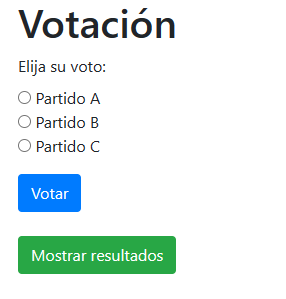

### Ejercicio Práctico Nº 1

Un grupo estudiantil desea llevar a cabo un sistema sencillo para las votaciones del centro de estudiantes de su colegio. Para ello, necesitan el desarrollo de una aplicación Java que cuente con las siguientes características:

1. Una página **JSP** donde se puedan realizar las siguientes acciones:
    
    1. Desplegar **3 opciones de votos** mediante **RadioButton** junto con un botón "Votar". Cada alumno debe ser capaz de seleccionar a qué partido quiere votar y al hacer click en votar se debe guardar el voto en una base de datos.
        
    2. Mostrar, mediante la presión de un botón "Mostrar resultados" en una tabla, la cantidad total de votos de cada uno de los candidatos hasta el momento.
        

#### ❓**Ayuda y referencias**

Ten en cuenta el siguiente modelo como referencia:

Al apretar el botón **Mostrar resultados**, debajo se deberá desplegar una tabla con los resultados de cada partido, donde en una columna esté el nombre del partido y en otra la cantidad de votos.

Por ejemplo:

|Nombre Partido|Cantidad Votos|
|---|---|
|Partido A|5|
|Partido B|3|
|Partido C|7|